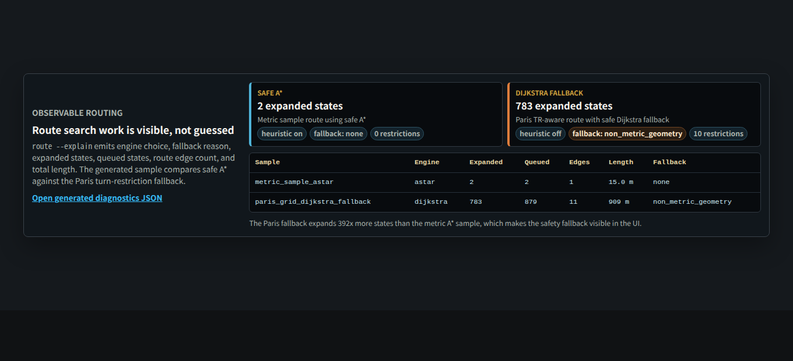
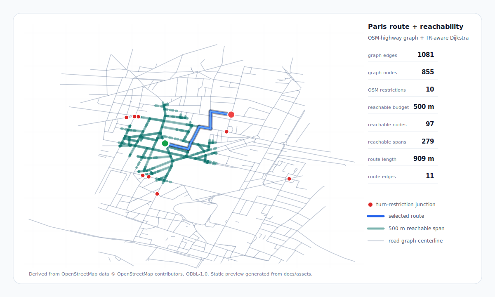

# roadgraph_builder

[](https://github.com/rsasaki0109/roadgraph_builder/actions/workflows/ci.yml)
[](LICENSE)
[](pyproject.toml)

**Construct road graphs from trajectory, OSM, LiDAR, and camera data.**

This project builds a **graph-first** intermediate representation: **nodes** (junctions/endpoints) and **edges** (lane/road segments) with **centerline polylines** and optional **attributes**. Output is **JSON** (`schema_version`) with optional **SVG** previews and a small static viewer in **`docs/`** (local preview, or GitHub Pages when the repository/plan supports it).

**Start here:** [Showcase](docs/SHOWCASE.md) · [Launch notes](docs/LAUNCH.md) · [Architecture](docs/ARCHITECTURE.md) · [Benchmarks](docs/benchmarks.md) · [Contributing](CONTRIBUTING.md)

### Why people star this repo

- **One pipeline, multiple map targets** — build once, then export navigation JSON, simulation GeoJSON, and Lanelet2-style OSM XML.
- **Real routing semantics** — shortest path, turn restrictions, observable A* / Dijkstra diagnostics, slope-aware cost, lane-change routing, service-area reachability, and turn-by-turn guidance share the same graph.
- **Sensor-ready without forcing heavy deps** — LiDAR LAS/LAZ, camera projection, lane-marking detection, HD-lite refinement, and schema validation are modular and mostly pure Python.
- **Measured, reproducible progress** — committed Paris visualization assets, benchmark baselines, accuracy reports, memory reports, release-bundle byte gates, and CI keep claims checkable.

### Measured results

v0.7.1 packages the post-v0.7.0 validation results below. Current `main` is
open for the next patch as `0.7.2.dev0`.

| Signal | Current result | Source |
| --- | --- | --- |
| **Routing** | Paris TR-aware route **909 m** vs unrestricted **878 m**; `route --explain` sample compares A* and Dijkstra fallback work | [map](docs/map.html) · [diagnostics compare](docs/index.html) · [JSON](docs/assets/route_explain_sample.json) |
| **Accuracy** | Lane-count MAE @ 20 m: Paris **0.938** / Tokyo **0.903** / Berlin **1.220** | [accuracy report](docs/accuracy_report.md) |
| **Tuning** | Conservative cross-city start: `--max-step-m 40 --merge-endpoint-m 8` | [tuning guide](docs/bundle_tuning.md) |
| **Memory** | Default remains **float64**; float32 is opt-in after replay showed small RSS wins and ID drift | [float32 report](docs/float32_drift_report.md) |

### GitHub “About” text (copy-paste)

Use the short description and topics listed in [`.github/ABOUT.md`](.github/ABOUT.md), or run the `gh repo edit` command there after the repository is public.

### Features

| Area | What works today |
| --- | --- |
| **Input** | Trajectory CSV (`timestamp`, `x`, `y`, optional `z`) · OSM highway ways (Overpass JSON) · LAS 1.0-1.4 / LAZ point clouds (2D or 3D XYZ) · image-space pixel detections + camera calibration · raw RGB images for lane-marking detection |
| **Pipeline** | Gap-based segmentation → arc-length Gaussian centerline → X/T-split + union-find → duplicate / near-parallel merge → junction consolidation → post-simplify. X/T-split uses an O(N log N) grid hash (v0.7). Separate OSM-highway path via `build-osm-graph` for topology-honest grids. 3D elevation propagates through edges (`polyline_z`, `slope_deg`) when `build --3d` reads a `z` column. Incremental `update-graph` merges new trajectories without a full rebuild. `process-dataset` runs the full bundle over a directory of CSVs in parallel. |
| **Routing** | A* / Dijkstra search honouring `no_*` / `only_*` turn restrictions, with `route --explain` diagnostics for engine choice and fallback reasons. OSM `type=restriction` relations map onto graph edges via `convert-osm-restrictions`. Uncertainty-aware via `route --prefer-observed` / `--min-confidence` (v0.6). Slope-aware via `route --uphill-penalty` / `--downhill-bonus` (v0.7). Lane-level via `route --allow-lane-change` with a per-swap `--lane-change-cost-m` (v0.7). `RoutePlanner` and `ReachabilityAnalyzer` reuse prepared topology for repeated route and service-area queries. Turn-by-turn guidance via **`guidance`**. |
| **Perception** | Pixel detections + pinhole calibration (OpenCV 5-coef Brown-Conrady distortion) → world ground plane → nearest edge via `project-camera`. Edge-keyed camera observations merge into `attributes.hd.semantic_rules` via `apply-camera`, and feed HD-lite refinement via `enrich --camera-detections-json`. **`detect-lane-markings-camera`** (v0.7) detects white/yellow lane markings from raw RGB with pure-NumPy HSV + connected components (no cv2/scipy) and back-projects to graph edges. |
| **LiDAR** | `fuse-lidar` accepts CSV / LAS / LAZ and fits per-edge binned median lane boundaries. `--ground-plane` (v0.7) fits a RANSAC ground plane first and keeps only points within `height_band_m` (default 0–0.3 m) before fusing, so vegetation and overhead structures drop out. `inspect-lidar` reports LAS public-header metadata. **`detect-lane-markings`** extracts painted-line candidates from intensity peaks. |
| **HD / Lanelet2** | `enrich --lane-width-m` for envelope + offset boundaries; `--lane-markings-json` / `--camera-detections-json` fuse sources into `metadata.hd_refinement`. **`infer-lane-count`** (v0.6) clusters paint-marker offsets into `attributes.hd.lane_count` + `hd.lanes[]` (fallback to `trace_stats.perpendicular_offsets`). `export-lanelet2` emits `roadgraph:*` ways + `lanelet` relations; `--per-lane` expands each multi-lane edge into one lanelet per lane with `lane_change` relations (v0.6); `--camera-detections-json` wires `traffic_light` / `stop_line` regulatory_elements (v0.7). **`validate-lanelet2-tags`** (v0.6) flags missing required Lanelet2 tags; **`validate-lanelet2`** (v0.7) bridges Autoware's `lanelet2_validation` CLI when on PATH. |
| **Output** | JSON (+ schema), GeoJSON, OSM XML 0.6 (Lanelet2-compatible), SVG. **`export-bundle`** writes nav / sim / lanelet / manifest in one directory. |
| **Benchmarks** | `make bench` runs a deterministic wall-clock suite (build / shortest path / map matching / reachability / export-bundle); `--baseline` compares against recorded numbers with a 3× regression gate. Baseline JSON in [`docs/assets/benchmark_baseline_0.7.2-dev.json`](docs/assets/benchmark_baseline_0.7.2-dev.json), notes in [`docs/benchmarks.md`](docs/benchmarks.md). Memory profile for v0.7 under [`docs/memory_profile_v0.7.md`](docs/memory_profile_v0.7.md) (Paris peak RSS 61→55 MB after the `export_lanelet2` DOM rewrite). Lane-count accuracy against OSM `lanes=` in [`docs/accuracy_report.md`](docs/accuracy_report.md). |
| **Demo** | Static viewer in [docs/](docs/) — [diagram](docs/index.html) · **[map](docs/map.html)** (OSM tiles, TR-aware click-to-route when served locally), static previews in [docs/images](docs/images/). |
| **Samples** | [Toy CSV](examples/sample_trajectory.csv), [OSM GPS](examples/osm_public_trackpoints.csv) (ODbL), [camera calibration + pixel detections](examples/demo_camera_calibration.json), [Paris OSM-grid + turn_restrictions](docs/assets/map_paris_grid.geojson) (ODbL). |

### Current release surface

The latest shipped tag is **v0.7.1**. It keeps the full v0.6/v0.7 command surface shown below: lane-count inference, per-lane Lanelet2 export, uncertainty-aware routing, 3D elevation, slope and lane-change routing, camera lane detection, ground-plane LiDAR, Autoware validator bridging, incremental updates, and dataset batch export.

v0.7.1 adds post-v0.7.0 validation and release-hardening work: canonical lane-count accuracy numbers for Paris / Tokyo / Berlin, cross-city bundle tuning, the Paris TR-aware visualization preview, opt-in float32 drift measurements, private-repo docs preview notes, release-bundle byte gates, and a CLI boundary refactor. See [CHANGELOG.md](CHANGELOG.md) `0.7.1` for the exact delta.

### Visualization results

The docs map ships a Paris OSM-highway graph with 10 mapped turn restrictions, a restriction-aware route overlay, and a 500 m reachability overlay from the same start node. The docs landing page also loads the generated `route --explain` sample and compares safe A* against the Paris Dijkstra fallback using expanded / queued state counts. These static assets are regenerated from committed GeoJSON / JSON inputs by `scripts/refresh_docs_assets.py`; the diagnostics screenshot below is rendered with `scripts/render_route_diagnostics_screenshot.py`. OSM-derived asset attribution is tracked in [`docs/assets/ATTRIBUTION.md`](docs/assets/ATTRIBUTION.md).

[](docs/index.html)

[](docs/map.html)

Open the interactive version locally: `cd docs && python3 -m http.server 8765`, then visit **`http://127.0.0.1:8765/map.html`**.

### Quick start

```bash
python3 -m venv .venv && .venv/bin/pip install -e .
.venv/bin/roadgraph_builder doctor
.venv/bin/roadgraph_builder build examples/sample_trajectory.csv out.json
.venv/bin/roadgraph_builder enrich out.json out_hd_envelope.json
.venv/bin/roadgraph_builder validate out_hd_envelope.json
```

From the repo root, **`make doctor`**, **`make demo`**, **`make tune`** (bundle + validate for parameter exploration), and **`make test`** are shortcuts (see `Makefile`). Tuning workflow: [docs/bundle_tuning.md](docs/bundle_tuning.md).

### Shipped in 0.6 / 0.7

Short pointer — see [`CHANGELOG.md`](CHANGELOG.md) and [`docs/PLAN.md`](docs/PLAN.md) for the full story.

```bash
# v0.6 — per-edge lane count + per-lane Lanelet2 + uncertainty-aware routing
roadgraph_builder infer-lane-count graph.json graph_lc.json --lane-markings-json lm.json
roadgraph_builder export-lanelet2 graph_lc.json map.osm --per-lane --lane-markings-json lm.json
roadgraph_builder validate-lanelet2-tags map.osm
roadgraph_builder route graph.json n0 n9 --prefer-observed --min-confidence 0.3

# v0.7 — 3D elevation + slope routing, camera lane detection, ground-plane LiDAR,
# lane-change routing, Autoware validator bridge, incremental / batch build
roadgraph_builder build trip.csv graph.json --3d
roadgraph_builder route graph.json n0 n9 --uphill-penalty 1.5 --downhill-bonus 0.9
roadgraph_builder detect-lane-markings-camera \
    graph.json calib.json ./images_dir/ poses.json --output lane_cands.json
roadgraph_builder fuse-lidar graph.json cloud.las fused.json --ground-plane
roadgraph_builder route graph.json n0 n9 --allow-lane-change --lane-change-cost-m 50
roadgraph_builder validate-lanelet2 map.osm              # uses Autoware's lanelet2_validation when on PATH
roadgraph_builder update-graph base.json new_trip.csv --output merged.json
roadgraph_builder process-dataset ./csvs/ ./bundles/ --origin-json origin.json --parallel 4
```

### Multiple passes over the same area (`--extra-csv`)

`build` and `export-bundle` accept repeated `--extra-csv PATH` to concatenate extra trajectory CSVs that share the primary input's meter origin. Overlapping passes get fused (duplicate / near-parallel merge); non-overlapping passes land as independent polylines. `attributes.direction_observed` on each edge flips to `bidirectional` when at least one pass traversed the edge in the opposite direction.

```bash
roadgraph_builder build examples/sample_trajectory.csv out.json \
  --extra-csv examples/another_pass.csv \
  --extra-csv examples/yet_another_pass.csv
```

### Three targets at once (nav SD / sim / Lanelet) — **export-bundle**

**日本語:** ナビ向け **SD シード**、シミュ用の **フルグラフ＋GeoJSON**、**Lanelet 互換 OSM** を、**いまあるパイプライン**で一括書き出します（完成品 HD ではなく、同じ土台を三系統に分ける）。

```bash
# WGS84 origin: either pass --origin-json (lat0/lon0 file) or --origin-lat / --origin-lon
roadgraph_builder export-bundle examples/sample_trajectory.csv ./out_bundle \
  --origin-json examples/toy_map_origin.json \
  --lane-width-m 3.5 \
  --detections-json examples/camera_detections_sample.json
```

For very large bundles, add `--compact-geojson` to write `sim/map.geojson` without pretty indentation, and `--compact-bundle-json` to compact `nav/sd_nav.json`, `sim/road_graph.json`, and `manifest.json`. Defaults remain pretty-printed so frozen release bundles and human diffs stay stable.

One-shot demo (validates detections, runs bundle, validates `manifest` + `sd_nav` + `road_graph`):

```bash
./scripts/run_demo_bundle.sh /tmp/my_bundle
```

**Parameter tuning** (same `export-bundle`, fewer extras; open `sim/map.geojson` in QGIS and adjust `max-step-m` / `merge-endpoint-m` — see [docs/bundle_tuning.md](docs/bundle_tuning.md)):

```bash
make tune
# or: ./scripts/run_tuning_bundle.sh /tmp/my_tune
```

| Output | Role |
| --- | --- |
| `out_bundle/manifest.json` | **Provenance** — tool version, UTC time, origin, input basename, output paths. `roadgraph_builder_version` and `generated_at_utc` are dynamic; the remaining fields are treated as stable release output. |
| `out_bundle/nav/sd_nav.json` | **SD / routing seed** — topology + edge `length_m`; `allowed_maneuvers` / `allowed_maneuvers_reverse` are **geometry heuristics** at the digitized end/start node (`straight`, and at junctions/dead-ends `left`/`right`/`u_turn` when inferred) |
| `out_bundle/sim/` | **Simulation / viz** — `road_graph.json`, `map.geojson`, `trajectory.csv` |
| `out_bundle/lanelet/map.osm` | **Lanelet / JOSM** — OSM XML (with lanelets when L/R boundaries exist) |

Use `--lane-width-m 0` to skip HD-lite ribbon offsets. Origin must match your GeoJSON / Lanelet convention (see `examples/*_origin.json`). Validate **`manifest.json`** with `roadgraph_builder validate-manifest` (`roadgraph_builder/schemas/manifest.schema.json`) and **`nav/sd_nav.json`** with `roadgraph_builder validate-sd-nav` (`sd_nav.schema.json`).

Release stability policy: the default sample bundle is rebuilt in tests and
stable generated files are compared byte-for-byte with
[`examples/frozen_bundle/`](examples/frozen_bundle/). `manifest.json` is
compared after normalizing only `roadgraph_builder_version` and
`generated_at_utc`; any other manifest drift is treated as a release-surface
change.

`allowed_maneuvers` is **not** a legal turn-restriction layer. It is a permissive 2D topology hint for routing/display; signs, signals, and turn bans should be carried in optional `turn_restrictions`. Design note: [docs/navigation_turn_restrictions.md](docs/navigation_turn_restrictions.md).

### Links

| Resource | URL |
| --- | --- |
| **Local viewer** | `docs/index.html` / `docs/map.html` (serve with `cd docs && python3 -m http.server 8765`) |
| **Changelog** | [CHANGELOG.md](CHANGELOG.md) |
| **Plan / handoff** | [docs/PLAN.md](docs/PLAN.md) |
| **PyPI** | Not published by default; see [PyPI (optional)](#pypi-optional) |

### Forks: URLs and OSM User-Agent

- **`scripts/refresh_docs_assets.py`** — set `ROADGRAPH_REPO_URL` and `ROADGRAPH_PAGES_URL` before running to rewrite `docs/assets/site.json` (footer links in the viewer).
- **`scripts/fetch_osm_trackpoints.py`** — set `ROADGRAPH_USER_AGENT` or pass `--user-agent` (OpenStreetMap [policy](https://operations.osmfoundation.org/policies/api/)).

## Concept

- **Graph first** — The road structure is a graph (nodes/edges); centerlines and boundaries are geometric attributes attached to that structure rather than defining it alone.
- **Multi-modal** — Trajectory, LiDAR, and camera inputs are separate, swappable modules; fusion is an explicit later stage (not baked into the core graph model).
- **Toward SD/HD maps** — The JSON graph is an intermediate representation you can enrich (semantics, topology) before exporting to map formats.

### SD map vs HD map (and this repo)

| | **SD map** (navigation / fleet) | **HD map** (AD / ADAS) |
| --- | --- | --- |
| **Typical use** | Routing, ETA, coarse “which roads connect” | Lane keeping, planning in lane coordinates, rules & obstacles |
| **Geometry** | Often **meter–tens of m** is acceptable for links | Often **lane boundaries**, **cm-class** accuracy in many specs |
| **Common inputs** | GNSS traces, road-network DBs, crowd probes | LiDAR, cameras, RTK/IMU, surveys, HD anchors |
| **This project today** | **Good fit as a seed:** graph + centerlines + topology attributes (`degree`, `junction_hint`), turn-restriction-aware routing, service-area reachability, and GeoJSON on OSM tiles for sanity checks | **HD-lite, not survey HD:** lane envelopes, lane-count inference, Lanelet2 export, LiDAR/camera hooks, and regulatory elements exist, but cm-class production maps still require calibrated data and validation |

**日本語で一言:** **SD** に向けた「道路のつながり＋中心線」の**中間表現**には使える。**HD** に必要な**レーン境界・高精度・規則**は、別データ（LiDAR 等）とセマンティクス層を足してから、という前提。

### SD → HD pipeline (in this repo)

| Stage | What it does | Status |
| --- | --- | --- |
| **1. SD seed** | `build` — graph + centerlines from trajectory CSV | **Implemented** |
| **2. HD envelope** | `enrich` — `metadata.sd_to_hd`, per-edge `attributes.hd` slots | **Implemented** |
| **3. Boundaries (HD-lite)** | `enrich --lane-width-m M` — centerline ± half width (no LiDAR) | **Implemented** (geometric prior; not survey HD) |
| **4. Boundaries (sensor)** | `fuse-lidar` — XY points (CSV or LAS 1.0–1.4 / LAZ) → per-edge binned median boundaries; `inspect-lidar` reports LAS public-header metadata | **Implemented** (simple proximity; not SLAM-grade; cross-format regression + real-data verification against 7 PDAL test LAS files incl. autzen_trim 110 K pts) |
| **5. Semantics (image)** | `project-camera` — pixel detections + pinhole camera (with Brown-Conrady distortion) + per-image vehicle pose → world ground plane → nearest edge; output is edge-keyed `camera_detections.json` | **Implemented** (pipeline math; detection + calibration are the caller's responsibility) |
| **6. Semantics (edge-keyed)** | `apply-camera` — JSON observations → `hd.semantic_rules`; OSM `speed_limit` + regulatory | **Implemented** |
| **7. Turn restrictions** | `convert-osm-restrictions` — OSM `type=restriction` relations → graph-space `turn_restrictions.json`; `route --turn-restrictions-json` honours `no_*` / `only_*` at each junction | **Implemented** |
| **8. Export** | `export-lanelet2` → OSM XML (`roadgraph:*` ways + `type=lanelet` relations + `type=regulatory_element, subtype=lane_connection` for junctions) | **Implemented** |

`enrich` without `--lane-width-m` only attaches placeholders. With **`--lane-width-m`**, you get **offset polylines** from each edge centerline — useful for visualization and simulation, **not** cm-class survey HD.

### What you get (and what you do not)

- **You get** a **road graph** (nodes and edges) with **centerline polylines** in the **same units as your CSV** (often meters after projection). That is **intermediate data** for fusion, mapping tools, or simulation—not a finished HD product by itself.
- **Do not expect** satellite-style photo maps, automatic alignment to aerial imagery, or perfect lane shapes without **tuning** (`max-step-m`, `merge-endpoint-m`, bin count, and data quality). GPS noise and dropouts directly affect the result.
- **`visualize` SVG** is a **diagram** (road-shaped centerlines, trajectory, nodes)—**not** aerial imagery or a finished “map product” yet. We are iterating on readability until it feels closer to a usable map view.

### Preview (images)

These are **static exports** from `roadgraph_builder visualize` (regenerate with `scripts/refresh_docs_assets.py`). They use a **map-inspired** style (grid, pseudo road width, scale bar) while staying honest about the data: **geometry comes from your CSV**, not from a satellite basemap.

**Toy trajectory** (small synthetic path):


**OSM public GPS** (real noisy samples; parameters tuned for the bundled CSV):


> **まだ「地図」では？** — 衛星写真や地図タイルのような“地図”ではありませんが、**道路構造を読むための図**としてはここまで寄せています。これからも見た目とアルゴリズムを詰めていきます。

### Interactive viewer (`docs/`)

The **`docs/`** folder is a small static site. This repository is currently private; on the current GitHub plan, private-repo GitHub Pages is not available, so the supported preview path is local.

Local preview (no GitHub required):

```bash
cd docs && python3 -m http.server 8765
# http://127.0.0.1:8765/          — diagram viewer
# http://127.0.0.1:8765/map.html  — OSM map + GeoJSON
```

When Pages is available (public repo, Pages-capable private repo plan, or a separate public static mirror):

1. In the GitHub repo: **Settings → Pages → Build and deployment → Source**: **Deploy from a branch**, branch **`main`**, folder **`/docs`**, Save.
2. After a minute, open the Pages URL shown by GitHub:
   - site root — diagram viewer (SVG-style pan/zoom)
   - `map.html` — **real basemap** (OSM tiles + GeoJSON: trajectory, centerlines, nodes, **HD-lite lane boundaries** when `attributes.hd` is filled — bundled assets use `enrich --lane-width-m 3.5` via `scripts/refresh_docs_assets.py`). Click any two nodes to route between them; the JS Dijkstra is **directed-state and TR-aware** when the dataset ships a restrictions overlay. The dropdown selects between four datasets:
     - **Paris grid** (default, 855 nodes / 1081 edges — derived from OSM highway ways, ships with 10 OSM turn restrictions as red-dot markers and a 500 m `reachable` overlay. ODbL.)
     - **Paris** (older, trajectory-derived, 123 edges / 223 nodes; from OSM public GPS, ODbL.)
     - **OSM Berlin sample** (4 edges, smaller).
     - **Toy** (synthetic trajectory from `examples/sample_trajectory.csv`).

Regenerate bundled JSON/CSV/SVG for `docs/` after changing examples or pipeline logic:

```bash
python3 scripts/refresh_docs_assets.py
```

## Requirements

- Python 3.10+
- `numpy`, `jsonschema` (for validating exported JSON)

## Install

From the repository root (use a virtual environment on PEP 668–managed systems):

```bash
python3 -m venv .venv
.venv/bin/pip install -e .
```

## Public trajectory sample (OpenStreetMap)

The file `examples/osm_public_trackpoints.csv` is **real, publicly contributed GPS data** fetched from the OpenStreetMap API (`/api/0.6/trackpoints`). It is intended for tuning `build` / `visualize` on noisy trajectories.

- **License / attribution:** OpenStreetMap data is © OpenStreetMap contributors and available under the **Open Database License (ODbL)**. See [openstreetmap.org/copyright](https://www.openstreetmap.org/copyright).
- **Regenerate** (optional; requires network): set a fork-specific agent if needed, then run:

```bash
export ROADGRAPH_USER_AGENT='myfork/1.0 (+https://github.com/you/roadgraph_builder)'
python3 scripts/fetch_osm_trackpoints.py -o examples/osm_public_trackpoints.csv
```

Also writes **`examples/osm_public_trackpoints_origin.json`** (WGS84 origin for the meters CSV) and **`examples/osm_public_trackpoints_wgs84.csv`** (`timestamp,lon,lat`) for map tooling.

Try another area if the bbox has no uploads: `--bbox min_lon,min_lat,max_lon,max_lat` (each side ≤ 0.25°).

Example (defaults are fine; **starting point for the committed OSM sample**):

```bash
roadgraph_builder build examples/osm_public_trackpoints.csv osm_graph.json \
  --max-step-m 40 --merge-endpoint-m 12 --centerline-bins 32
roadgraph_builder visualize examples/osm_public_trackpoints.csv osm_preview.svg \
  --max-step-m 40 --merge-endpoint-m 12 --centerline-bins 32
```

## Usage (CLI)

```bash
roadgraph_builder build examples/sample_trajectory.csv out.json
```

Optional tuning:

```bash
roadgraph_builder build input.csv out.json --max-step-m 25 --merge-endpoint-m 8 --centerline-bins 32
```

- `--max-step-m` — Split the time-ordered path when consecutive samples are farther apart (meters); mimics trip/gap segmentation (MVP “clustering”).
- `--merge-endpoint-m` — Snap nearby polyline endpoints into one graph node (meters).
- `--centerline-bins` — PCA bin count for smoothing each segment’s centerline.
- `--simplify-tolerance` — Douglas–Peucker tolerance (meters) to thin edge polylines after centerline fit; omit to keep all centerline points.

**Node metadata (topology):** each exported node may include `attributes.degree` (undirected edge count) and `attributes.junction_hint` (`dead_end`, `through_or_corner`, `multi_branch`).

### Visualize (SVG)

Renders raw trajectory points, edge polylines, and node IDs (no extra dependencies beyond NumPy):

```bash
roadgraph_builder visualize examples/sample_trajectory.csv preview.svg
```

### Tuning workflow (recommended)

1. Run `build` on your CSV, then `visualize` to the same base name (`.svg`).
2. **Too many short edges** — increase `--max-step-m` so small GPS jumps do not split the path.
3. **Too few edges / merged roads** — decrease `--max-step-m` to split at real gaps (parking ↔ road, ferry, etc.).
4. **Duplicate nodes at one junction** — increase `--merge-endpoint-m` so nearby endpoints snap together.
5. **Over-merged junctions** — decrease `--merge-endpoint-m`.
6. **Jagged centerline** — raise `--centerline-bins` for smoother polylines, or lower if you need fewer points.

### Enrich (SD → HD envelope)

After `build`, run `enrich` to attach document `metadata.sd_to_hd` and per-feature `attributes.hd`. Add **`--lane-width-m`** (meters) to generate **left/right boundary polylines** by offsetting the centerline (HD-lite):

```bash
roadgraph_builder build examples/sample_trajectory.csv out.json
roadgraph_builder enrich out.json out_hd_envelope.json
roadgraph_builder enrich out.json out_hd_lite.json --lane-width-m 3.5
roadgraph_builder validate out_hd_lite.json
```

**Multi-source refinement (0.5.0+).** With `--lane-markings-json` / `--camera-detections-json` the enrich pass fuses per-edge half-width + confidence from LiDAR-derived lane markings, `attributes.trace_stats` (when trace fusion has run), and camera observations into `metadata.hd_refinement`. Absent sources are simply skipped, so the command degrades gracefully. `export-bundle` exposes the same flags as `--lane-markings-json` / `--camera-detections-refine-json`.

### Fuse LiDAR-style XY points (boundaries)

Given a graph JSON and a point set in the **same meter frame** as the trajectory, assign points to nearby edges and write **left/right** boundary polylines (binned median along the centerline). `fuse-lidar` accepts three input shapes and dispatches on the file extension:

- Two-column **x,y** CSV.
- **LAS 1.0 – 1.4** (uncompressed `.las`) — X/Y are read straight from the public header's point records, scale and offset applied.
- **LAZ** (`.laz`) — compressed LAS; requires the optional `[laz]` extra (`pip install 'roadgraph-builder[laz]'`). Falls back to a clear `ImportError` when the extra is missing.

```bash
roadgraph_builder build examples/sample_trajectory.csv out.json
# text CSV
roadgraph_builder fuse-lidar out.json examples/sample_lidar_points.csv fused.json --max-dist-m 5 --bins 32
# LAS (committed sample)
roadgraph_builder fuse-lidar out.json examples/sample_lidar.las fused_las.json --max-dist-m 5 --bins 16
roadgraph_builder validate fused.json
```

Inspect a LAS file's header without touching point records:

```bash
roadgraph_builder inspect-lidar examples/sample_lidar.las
```

Edges with fewer than two accepted points in total are unchanged. Tune `--max-dist-m` for your cloud density.

### Detect lane markings (LiDAR intensity, 0.5.0+)

`detect-lane-markings` recovers painted lane lines without ML by extracting high-intensity peaks per edge (percentile threshold + along-edge binning + lateral clustering). Points within `--max-lateral-m` of each edge centerline are projected to (along, across) coordinates; sustained clusters above the intensity threshold become left / right / center candidates. Writes `lane_markings.json` that `validate-lane-markings` and `enrich --lane-markings-json` consume.

```bash
roadgraph_builder detect-lane-markings out.json points.las lane_markings.json \
  --max-lateral-m 2.5 --intensity-percentile 85 --along-edge-bin-m 1.0
roadgraph_builder validate-lane-markings lane_markings.json
```

### Map matching (snap a trajectory to the graph)

Given a road graph and a new trajectory CSV in the same meter frame, `match-trajectory` projects each sample onto the closest edge's polyline and summarises how well the trajectory tracks the graph. Repeated samples use a graph-local edge spatial index, and `--hmm` uses the same indexed candidate lookup before Viterbi decoding.

```bash
roadgraph_builder match-trajectory /tmp/rg_bundle/sim/road_graph.json \
  examples/sample_trajectory.csv --max-distance-m 5 --output /tmp/match.json
# Summary on stdout; per-sample snap details in /tmp/match.json
```

Samples farther than `--max-distance-m` from any edge are reported as unmatched in both the summary and the detailed JSON.

### Shortest path (routing)

A* / Dijkstra over centerline lengths, with optional **turn restrictions**. A*
is used only when straight-line node distance is a safe lower bound for the
configured edge costs; discounted costs fall back to Dijkstra. By default edges
are traversable in both directions; with `--turn-restrictions-json` the search
respects `no_left_turn` / `no_right_turn` / `no_straight` / `no_u_turn`
(forbidden transitions) and `only_left` / `only_right` / `only_straight`
(whitelisted transitions) at the specified junction / incoming approach.

```bash
# Find the nearest graph node to a coordinate
roadgraph_builder nearest-node examples/frozen_bundle/sim/road_graph.json \
  --latlon 52.52 13.4054
# => {"node_id":"n1","distance_m":1.7,"query_xy_m":[...]}

# Plain shortest path
roadgraph_builder route examples/frozen_bundle/sim/road_graph.json n0 n1
# => {"from_node":"n0","to_node":"n1","total_length_m":15.02,"edge_sequence":["e0"],"edge_directions":["forward"],"node_sequence":["n0","n1"],"applied_restrictions":0}

# Explain the search engine choice and queue work
roadgraph_builder route examples/frozen_bundle/sim/road_graph.json n0 n1 --explain
# => "diagnostics": {"search_engine":"astar","heuristic_enabled":true,"fallback_reason":null,...}

# Respecting the bundle's nav/sd_nav.json (or a standalone turn_restrictions.json)
roadgraph_builder route examples/frozen_bundle/sim/road_graph.json n0 n1 \
  --turn-restrictions-json examples/frozen_bundle/nav/sd_nav.json

# Also write a GeoJSON of the traversed centerlines (merged LineString + per-edge features + start/end points)
roadgraph_builder route examples/frozen_bundle/sim/road_graph.json n0 n1 \
  --output /tmp/route.geojson
# Origin is read from metadata.map_origin; pass --origin-lat / --origin-lon to override.

# Route by lat/lon — auto-snap to the nearest graph nodes
roadgraph_builder route examples/frozen_bundle/sim/road_graph.json \
  --from-latlon 52.520 13.4050 --to-latlon 52.520 13.4056
# Output includes snapped_from / snapped_to with the distance from the query point to the matched node.

# Reachability / service-area style query from a node
roadgraph_builder reachable examples/frozen_bundle/sim/road_graph.json n0 \
  --max-cost-m 250 \
  --turn-restrictions-json examples/frozen_bundle/nav/sd_nav.json \
  --output /tmp/reachable.geojson
# => nodes and directed edge spans reachable within the budget; partial edges are clipped in GeoJSON.
```

`reachable` accepts `--start-latlon LAT LON` for the same nearest-node snap used by `route --from-latlon`. Its cost hooks (`--prefer-observed`, `--min-confidence`, `--uphill-penalty`, `--downhill-bonus`) match `route`, so the JSON / GeoJSON service area reflects the same routing policy.

`route --explain` leaves the normal route fields intact and adds `diagnostics`
with `search_engine`, `heuristic_enabled`, `fallback_reason`, `expanded_states`,
`queued_states`, `route_edge_count`, and `total_length_m`. Fallback reasons
include `cost_discount`, `non_metric_geometry`, `dangling_node`, and
`lane_level`.

Exits with code 1 on unknown node ids, disjoint components, or when the restrictions make the pair unreachable.

### Turn-by-turn guidance (0.5.0+)

After `route --output` produces a route GeoJSON, `guidance` converts the merged LineString + per-edge features into a step list with maneuver categories (`depart` / `arrive` / `straight` / `slight_left` / `left` / `sharp_left` / `slight_right` / `right` / `sharp_right` / `u_turn` / `continue`). Heading change is signed (+ right, − left). Uses `sd_nav.json`'s `allowed_maneuvers` + the edge geometry — no extra data needed beyond the existing bundle.

```bash
roadgraph_builder route examples/frozen_bundle/sim/road_graph.json n0 n1 \
  --output /tmp/route.geojson
roadgraph_builder guidance /tmp/route.geojson examples/frozen_bundle/nav/sd_nav.json \
  --output /tmp/guidance.json \
  --slight-deg 20 --sharp-deg 120 --u-turn-deg 165
roadgraph_builder validate-guidance /tmp/guidance.json
```

### Export OSM / Lanelet2 tooling

Writes **OSM XML 0.6** (nodes, ways, relations) in **WGS84** using the same local tangent-plane origin as `export_map_geojson`. Ways use `roadgraph:*`; edges with **both** left and right `hd.lane_boundaries` get a **`type=lanelet`** relation (`left` / `right` members, optional `centerline`).

```bash
roadgraph_builder build examples/sample_trajectory.csv out.json
roadgraph_builder enrich out.json out_hd.json --lane-width-m 3.5
roadgraph_builder export-lanelet2 out_hd.json map.osm --origin-lat 35.68 --origin-lon 139.76
```

If the JSON has `metadata.map_origin` (`lat0`, `lon0`), you can omit `--origin-lat` / `--origin-lon`.

### Build a graph from OSM highways (and map turn restrictions)

`build-osm-graph` takes a raw Overpass response of drivable `way["highway"]`s and runs the same X/T-split + endpoint union-find pipeline used for trajectory CSVs — every OSM junction becomes a graph node with `metadata.map_origin` preserved. `convert-osm-restrictions` then snaps OSM `type=restriction` relations onto that graph (via-node → nearest graph node within `--max-snap-m`, from/to ways matched by edge tangent alignment) and writes a schema-valid `turn_restrictions.json` that `export-bundle --turn-restrictions-json` and `route --turn-restrictions-json` consume.

```bash
# Fetch OSM (raw outputs stay under /tmp by convention)
python scripts/fetch_osm_highways.py --bbox "2.337,48.857,2.357,48.877" \
  -o /tmp/paris_highways.json
python scripts/fetch_osm_turn_restrictions.py --bbox "2.337,48.857,2.357,48.877" \
  -o /tmp/paris_turn_restrictions.json

# Build graph + map restrictions
roadgraph_builder build-osm-graph /tmp/paris_highways.json /tmp/paris_grid.json \
  --origin-lat 48.867 --origin-lon 2.347 \
  --simplify-tolerance 0.0 --merge-endpoint-m 2.0
roadgraph_builder convert-osm-restrictions /tmp/paris_grid.json \
  /tmp/paris_turn_restrictions.json /tmp/paris_turn_restrictions_graph.json \
  --skipped-json /tmp/paris_tr_skipped.json

# Route honouring the restrictions
roadgraph_builder route /tmp/paris_grid.json n312 n191 \
  --turn-restrictions-json /tmp/paris_turn_restrictions_graph.json
```

The `scripts/fetch_osm_*.py` helpers accept `--endpoint` (or `OVERPASS_ENDPOINT`) so you can point at a mirror if the default instance is saturated.

### Project camera pixels onto graph edges

`project-camera` takes a `CameraCalibration` (intrinsic `fx, fy, cx, cy` + optional Brown-Conrady distortion `(k1, k2, p1, p2, k3)` + rigid `camera_to_vehicle` mount) and a per-image pixel-detections JSON (each image carries its vehicle pose + a list of `(u, v, kind)` detections), projects every pixel onto the ground plane at `--ground-z-m`, and snaps the result to the nearest graph edge within `--max-edge-distance-m`. Output matches `camera_detections.schema.json` so `apply-camera` / `export-bundle` consume it unchanged.

```bash
roadgraph_builder project-camera \
  examples/demo_camera_calibration.json \
  examples/demo_image_detections.json \
  graph.json camera_detections.json \
  --max-edge-distance-m 5
```

Above-horizon rays and detections farther than `--max-edge-distance-m` from any edge are dropped and counted separately; the CLI prints the breakdown on exit.

See [`docs/camera_pipeline_demo.md`](docs/camera_pipeline_demo.md) for an end-to-end walkthrough plus a recipe for plugging in your own data (the shipped demo is synthetic-but-realistic so round-trip ground truth is provable).

### Apply camera / perception JSON (semantics)

Use a sidecar JSON with an ``observations`` array (``edge_id``, ``kind``, optional ``value_kmh`` / ``confidence``). Rules merge into ``attributes.hd.semantic_rules``. When exporting OSM lanelets, ``speed_limit`` maps to Lanelet2-style tags; kinds like ``traffic_light`` or ``stop_line`` add ``regulatory_element`` relations.

```bash
roadgraph_builder validate-detections examples/camera_detections_sample.json
roadgraph_builder apply-camera graph.json examples/camera_detections_sample.json with_semantics.json
```

Bundled schema: `roadgraph_builder/schemas/camera_detections.schema.json`. GeoJSON centerlines gain `semantic_summary` for map popups (`docs/map.html`).

### Validate JSON (schema)

Exports include **`schema_version`** (currently `1`) and are described by `roadgraph_builder/schemas/road_graph.schema.json` (JSON Schema Draft 2020-12). Optional top-level **`metadata`** holds pipeline notes (for example `sd_to_hd`). Edge/node **`attributes.hd`** may include **`semantic_rules`** (each rule must have **`kind`**).

```bash
roadgraph_builder build examples/sample_trajectory.csv out.json
roadgraph_builder validate out.json
```

### Tests

```bash
.venv/bin/pip install -e ".[dev]"
PYTEST_DISABLE_PLUGIN_AUTOLOAD=1 .venv/bin/pytest
```

`PYTEST_DISABLE_PLUGIN_AUTOLOAD=1` avoids loading broken global `pytest` plugins on some systems (for example ROS) that are unrelated to this project.

### Benchmarks (0.5.0+)

`make bench` (or `python scripts/run_benchmarks.py`) runs a fixed set of deterministic wall-clock timings: `polylines_to_graph_paris` / `polylines_to_graph_10k_synth` (50×50 synthetic grid) / `shortest_path_paris` (100 small-graph queries) / `shortest_path_grid_120_functional` (120 repeated public wrapper calls) / `shortest_path_grid_120` (120 routes on a 55×55 routing grid using one prepared `RoutePlanner`) / `reachable_grid_120` (120 service-area queries on the same grid) / `nearest_node_grid_2000` (2000 snaps on a 300×300 node grid) / `map_match_grid_5000` (5000 nearest-edge snaps on a 120×120 grid graph) / `export_geojson_grid_120_compact` (compact GeoJSON export on a 120×120 grid) / `export_bundle_json_grid_120_compact` (compact bundle JSON writer on a 120×120 grid) / `export_bundle_end_to_end`. Finishes under a minute on a laptop CPU. Pass `--baseline docs/assets/benchmark_baseline_0.7.2-dev.json` to compare and exit non-zero when any metric is ≥ 3× slower than the baseline; pass `--output new-baseline.json` to save a refreshed result set. Latest numbers live in [`docs/benchmarks.md`](docs/benchmarks.md).

### CI

GitHub Actions (`.github/workflows/ci.yml`) runs `pytest` on Python 3.10 and 3.12, then **`validate-detections`** on `examples/camera_detections_sample.json`, **`validate`** on `docs/assets/sample_graph.json` and `docs/assets/osm_graph.json`, and **`export-bundle`** then **`validate-manifest`** + **`validate-sd-nav`** + **`validate`** on `manifest.json` / `nav/sd_nav.json` / `sim/road_graph.json`, for every push and pull request to `main`/`master`. The pytest release-bundle gate also rebuilds the default sample bundle and compares frozen outputs, with only manifest version/timestamp normalized.

Local parity:

```bash
roadgraph_builder validate-detections examples/camera_detections_sample.json
roadgraph_builder validate docs/assets/sample_graph.json
roadgraph_builder validate docs/assets/osm_graph.json
roadgraph_builder export-bundle examples/sample_trajectory.csv /tmp/rg_bundle --origin-json examples/toy_map_origin.json --lane-width-m 3.5
roadgraph_builder validate-manifest /tmp/rg_bundle/manifest.json
roadgraph_builder validate-sd-nav /tmp/rg_bundle/nav/sd_nav.json
roadgraph_builder validate /tmp/rg_bundle/sim/road_graph.json
roadgraph_builder export-bundle examples/sample_trajectory.csv /tmp/rg_bundle_compact --origin-json examples/toy_map_origin.json --lane-width-m 0 --compact-geojson --compact-bundle-json
```

## Package layout

See [`docs/ARCHITECTURE.md`](docs/ARCHITECTURE.md) for a single-page map
with Mermaid diagrams of the data flow, CLI surface, bundle layout, and
routing subsystem.

Python package: `roadgraph_builder/`

| Path | Role |
| --- | --- |
| `roadgraph_builder/core/graph/` | Node, Edge, Graph models |
| `roadgraph_builder/io/trajectory/` | Trajectory CSV loader |
| `roadgraph_builder/io/lidar/` | `load_points_xy_csv`, `load_points_xy_from_las`, `read_las_header` (pure-Python LAS 1.0-1.4 reader, LAZ via optional `[laz]` extra) |
| `roadgraph_builder/io/camera/` | `load_camera_detections_json`, `apply_camera_detections_to_graph`, `CameraCalibration` + `pixel_to_ground` + `project_image_detections_to_graph_edges` (pinhole + Brown-Conrady distortion) |
| `roadgraph_builder/io/osm/` | `build_graph_from_overpass_highways`, `convert_osm_restrictions_to_graph` (Overpass → graph / turn_restrictions) |
| `roadgraph_builder/io/export/` | JSON; GeoJSON (optional attribution/license fields); `export_lanelet2`; bundle (`nav`/`sim`/`lanelet`) |
| `roadgraph_builder/pipeline/` | `build_graph` pipeline |
| `roadgraph_builder/hd/` | `enrich_sd_to_hd`, `fuse_lane_boundaries_from_points`, centerline offsets |
| `roadgraph_builder/utils/geometry.py` | Clustering / centerline helpers |
| `roadgraph_builder/viz/` | SVG export (trajectory + graph) |
| `roadgraph_builder/semantics/` | Trace fusion, map matching summaries, trip reconstruction, road-class and signalized-junction inference |
| `roadgraph_builder/schemas/` | `road_graph`, `camera_detections`, `sd_nav`, `manifest` (`.schema.json`) |
| `roadgraph_builder/validation/` | `validate_*_document()` for graph, detections, `sd_nav`, manifest |
| `roadgraph_builder/cli/` | Thin dispatcher plus domain command modules (`build`, `validate`, `routing`, `export`, `camera`, `lidar`, `osm`, `guidance`, `trajectory`, `hd`, `incremental`, `dataset`) |
| `docs/` | Static viewer + bundled sample assets |
| `scripts/refresh_docs_assets.py` | Regenerate `docs/assets` and `docs/images` |
| `scripts/render_route_diagnostics_screenshot.py` | Render the README route diagnostics comparison PNG with headless Chrome |
| `scripts/compare_float32_drift.py` | Rebuild float64/float32 bundles and report topology / coordinate drift |
| `scripts/run_demo_bundle.sh` | Validate → `export-bundle` → validate outputs (demo) |
| `roadgraph_builder/io/export/geojson.py` | `export_map_geojson()` for Leaflet / OSM |
| `roadgraph_builder/utils/geo.py` | meters ↔ WGS84; `load_wgs84_origin_json` |
| `.github/ABOUT.md` | Short text + topics for GitHub **About** |

## Future extensions

- **Real-data camera integration (user-driven)** — `project-camera` works on any pixel-detections JSON + calibration. The shipped demo is synthetic with embedded ground truth so round-trip accuracy is provable; users wanting to run it on real photography can follow `docs/camera_pipeline_demo.md`. This repo intentionally does not ship imagery with viral license terms (e.g. Mapillary CC-BY-SA) so the MIT distribution stays unambiguous.
- **LiDAR-derived lane centerlines** — today `fuse-lidar` fits the *boundary ribbon* from nearby points; a future pass could infer per-lane centerlines directly from the cloud.
- **Semantics layer** — broader lane-type / rule / priority model (separate from raw geometry) beyond the current `attributes.hd.semantic_rules` free-form dict.
- **HD-complete Lanelet2 export** — the current `export_lanelet2` emits lanelet relations where boundaries exist and a regulatory-element relation per junction; full Autoware-ready HD export (traffic signals as referenced points, stop lines as ways, right-of-way relations) is still future work.

Codebase TODOs also mention: graph fusion across tiles/modalities and routing graph generation for other pathfinders (A* / Contraction Hierarchies).

## Sample bundle

A frozen reference output lives at [`examples/frozen_bundle/`](examples/frozen_bundle/)
so you can browse the shape of `export-bundle` without running the pipeline
(`manifest.json`, `nav/sd_nav.json`, `sim/{road_graph,map,trajectory}`,
`lanelet/map.osm`). The frozen build runs the **full optional pipeline** —
HD-lite enrich, LAS-fused LiDAR boundaries, camera detections, and turn
restrictions — so the output reflects the maximal artifact shape. Regenerate
with `make release-bundle` or `bash scripts/build_release_bundle.sh`; the
script also packs `dist/roadgraph_sample_bundle.tar.gz` + a sha256 file
suitable for attaching to a release.

The frozen bundle doubles as a release contract. Stable generated artifacts are
byte-compared in tests. `manifest.json` is normalized only for
`roadgraph_builder_version` and `generated_at_utc`; origin, inputs, graph
stats, junction counts, optional-source metadata, and output paths must match
the checked-in frozen manifest unless the release surface intentionally
changes.

Every `v*` tag push triggers [`.github/workflows/release.yml`](.github/workflows/release.yml),
which runs the same script and attaches the tarball + sha256 to the auto-created
GitHub Release.

## API docs (pdoc)

`make docs` renders docstrings into a static site under `build/docs/`.
Requires the `[docs]` extra (`pip install -e ".[docs]"`). Open
`build/docs/roadgraph_builder.html` in a browser. Not deployed to a
public URL — this is for local reference only.

## Shell completion

Hand-written bash and zsh completion scripts live under
[`scripts/completions/`](scripts/completions/). They complete the
subcommands and the common `--turn-restrictions-json` / `--output` /
`--origin-*` / `--lidar-points` style path arguments. The completion smoke
test derives the expected subcommands from the argparse parser, so future CLI
additions should update the scripts in the same change instead of drifting.

```bash
# Bash (per-user)
mkdir -p ~/.local/share/bash-completion/completions
cp scripts/completions/roadgraph_builder.bash \
   ~/.local/share/bash-completion/completions/roadgraph_builder

# Zsh (per-user)
mkdir -p ~/.zsh/completions
cp scripts/completions/_roadgraph_builder ~/.zsh/completions/
# then in ~/.zshrc:
#   fpath=(~/.zsh/completions $fpath)
#   autoload -Uz compinit && compinit
```

`roadgraph_builder --version` (or `-V`) prints the installed package version.

## Releases

Changes are listed in [CHANGELOG.md](CHANGELOG.md).

Tag and push a version (example `v0.1.0`):

```bash
git tag -a v0.1.0 -m "Release 0.1.0"
git push origin main
git push origin v0.1.0
```

The release workflow above then builds and attaches
`roadgraph_sample_bundle.tar.gz` + `roadgraph_sample_bundle.sha256` to the
auto-generated release notes.

## PyPI (optional)

The distribution name in `pyproject.toml` is `roadgraph-builder`.

### Manual publish

1. Create a [PyPI](https://pypi.org/) account and an **API token** with upload permission for this project.
2. Install build tools: `python -m pip install build twine`.
3. From a clean checkout: `python -m build` then `twine upload dist/*` (use API token when prompted).

### Workflow scaffold (Trusted Publisher, no secrets)

[`.github/workflows/pypi.yml`](.github/workflows/pypi.yml) is a `workflow_dispatch`-only
scaffold that builds sdist + wheel and publishes via [`pypa/gh-action-pypi-publish`](https://github.com/pypa/gh-action-pypi-publish).
To enable, configure [Trusted Publishers](https://docs.pypi.org/trusted-publishers/) on
the PyPI project (`workflow: pypi.yml`, `environment: pypi`) and add a matching
GitHub Environment. No tokens live in this repository.

## Contributing

See [`CONTRIBUTING.md`](CONTRIBUTING.md) for dev setup, test commands, and
the conventions used across the repo (one-topic commits, no Co-Authored-By
trailers, schema discipline, data hygiene).

## License

Released under the [MIT License](LICENSE). © 2026 Ryohei Sasaki.
