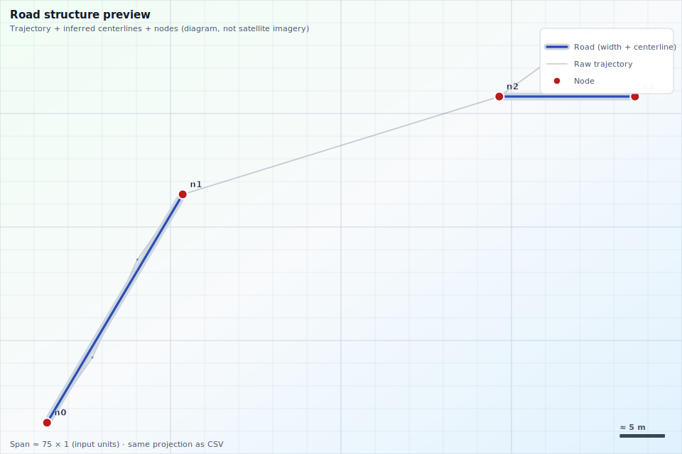
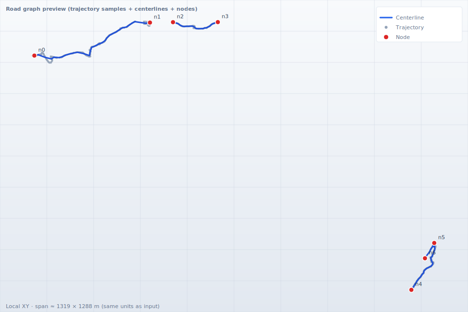

# roadgraph_builder

[](https://github.com/rsasaki0109/roadgraph_builder/actions/workflows/ci.yml)
[](LICENSE)
[](pyproject.toml)

**Construct road graphs from trajectory, LiDAR, and camera data** (MVP: **trajectory CSV only**).

This project builds a **graph-first** intermediate representation: **nodes** (junctions/endpoints) and **edges** (lane/road segments) with **centerline polylines** and optional **attributes**. Output is **JSON** (`schema_version`) with optional **SVG** previews and an **interactive viewer** on **GitHub Pages** (`docs/`).

### GitHub “About” text (copy-paste)

Use the short description and topics listed in [`.github/ABOUT.md`](.github/ABOUT.md), or run `gh repo edit` (see below).

### Features

| Area | What works today |
| --- | --- |
| **Input** | Trajectory CSV (`timestamp`, `x`, `y`) |
| **Pipeline** | Gap-based segmentation → PCA centerline → endpoint merge → graph |
| **Output** | JSON + `visualize` SVG + `validate` + `enrich` + `fuse-lidar` + **`export-bundle`** (3-way) |
| **Demo** | [Diagram viewer](https://rsasaki0109.github.io/roadgraph_builder/) · **[Map (OSM tiles)](https://rsasaki0109.github.io/roadgraph_builder/map.html)** (enable Pages on `/docs`), static previews in [docs/images](docs/images/) |
| **Samples** | [Toy CSV](examples/sample_trajectory.csv), [OSM GPS](examples/osm_public_trackpoints.csv) (ODbL) |
| **Next** | Raw camera images **stub**; perception JSON → ``apply-camera`` + OSM tags works |

### Quick start

```bash
python3 -m venv .venv && .venv/bin/pip install -e .
.venv/bin/roadgraph_builder doctor
.venv/bin/roadgraph_builder build examples/sample_trajectory.csv out.json
.venv/bin/roadgraph_builder enrich out.json out_hd_envelope.json
.venv/bin/roadgraph_builder validate out_hd_envelope.json
```

From the repo root, **`make doctor`**, **`make demo`**, **`make tune`** (bundle + validate for parameter exploration), and **`make test`** are shortcuts (see `Makefile`). Tuning workflow: [docs/bundle_tuning.md](docs/bundle_tuning.md).

### Three targets at once (nav SD / sim / Lanelet) — **export-bundle**

**日本語:** ナビ向け **SD シード**、シミュ用の **フルグラフ＋GeoJSON**、**Lanelet 互換 OSM** を、**いまあるパイプライン**で一括書き出します（完成品 HD ではなく、同じ土台を三系統に分ける）。

```bash
# WGS84 origin: either pass --origin-json (lat0/lon0 file) or --origin-lat / --origin-lon
roadgraph_builder export-bundle examples/sample_trajectory.csv ./out_bundle \
  --origin-json examples/toy_map_origin.json \
  --lane-width-m 3.5 \
  --detections-json examples/camera_detections_sample.json
```

One-shot demo (validates detections, runs bundle, validates `manifest` + `sd_nav` + `road_graph`):

```bash
./scripts/run_demo_bundle.sh /tmp/my_bundle
```

**Parameter tuning** (same `export-bundle`, fewer extras; open `sim/map.geojson` in QGIS and adjust `max-step-m` / `merge-endpoint-m` — see [docs/bundle_tuning.md](docs/bundle_tuning.md)):

```bash
make tune
# or: ./scripts/run_tuning_bundle.sh /tmp/my_tune
```

| Output | Role |
| --- | --- |
| `out_bundle/manifest.json` | **Provenance** — tool version, UTC time, origin, input basename, output paths |
| `out_bundle/nav/sd_nav.json` | **SD / routing seed** — topology + edge `length_m`; `allowed_maneuvers` / `allowed_maneuvers_reverse` are **geometry heuristics** at the digitized end/start node (`straight`, and at junctions/dead-ends `left`/`right`/`u_turn` when inferred) |
| `out_bundle/sim/` | **Simulation / viz** — `road_graph.json`, `map.geojson`, `trajectory.csv` |
| `out_bundle/lanelet/map.osm` | **Lanelet / JOSM** — OSM XML (with lanelets when L/R boundaries exist) |

Use `--lane-width-m 0` to skip HD-lite ribbon offsets. Origin must match your GeoJSON / Lanelet convention (see `examples/*_origin.json`). Validate **`manifest.json`** with `roadgraph_builder validate-manifest` (`roadgraph_builder/schemas/manifest.schema.json`) and **`nav/sd_nav.json`** with `roadgraph_builder validate-sd-nav` (`sd_nav.schema.json`).

`allowed_maneuvers` is **not** a legal turn-restriction layer. It is a permissive 2D topology hint for routing/display; signs, signals, and turn bans should be carried in optional `turn_restrictions`. Design note: [docs/navigation_turn_restrictions.md](docs/navigation_turn_restrictions.md).

### Links

| Resource | URL |
| --- | --- |
| **Live viewer** (after Pages) | `https://rsasaki0109.github.io/roadgraph_builder/` |
| **Changelog** | [CHANGELOG.md](CHANGELOG.md) |
| **Plan / handoff** | [docs/PLAN.md](docs/PLAN.md) |
| **PyPI** | Not published by default; see [PyPI (optional)](#pypi-optional) |

### Forks: URLs and OSM User-Agent

- **`scripts/refresh_docs_assets.py`** — set `ROADGRAPH_REPO_URL` and `ROADGRAPH_PAGES_URL` before running to rewrite `docs/assets/site.json` (footer links in the viewer).
- **`scripts/fetch_osm_trackpoints.py`** — set `ROADGRAPH_USER_AGENT` or pass `--user-agent` (OpenStreetMap [policy](https://operations.osmfoundation.org/policies/api/)).

## Concept

- **Graph first** — The road structure is a graph (nodes/edges); centerlines and boundaries are geometric attributes attached to that structure rather than defining it alone.
- **Multi-modal** — Trajectory, LiDAR, and camera inputs are separate, swappable modules; fusion is an explicit later stage (not baked into the core graph model).
- **Toward SD/HD maps** — The JSON graph is an intermediate representation you can enrich (semantics, topology) before exporting to map formats.

### SD map vs HD map (and this repo)

| | **SD map** (navigation / fleet) | **HD map** (AD / ADAS) |
| --- | --- | --- |
| **Typical use** | Routing, ETA, coarse “which roads connect” | Lane keeping, planning in lane coordinates, rules & obstacles |
| **Geometry** | Often **meter–tens of m** is acceptable for links | Often **lane boundaries**, **cm-class** accuracy in many specs |
| **Common inputs** | GNSS traces, road-network DBs, crowd probes | LiDAR, cameras, RTK/IMU, surveys, HD anchors |
| **This project today** | **Good fit as a seed:** graph + centerlines + topology attributes (`degree`, `junction_hint`), plus GeoJSON on OSM tiles for sanity checks | **Not HD-complete:** lane **boundaries** are not produced yet; LiDAR/camera are **stubs**; Lanelet2 / full semantics are **future** work |

**日本語で一言:** **SD** に向けた「道路のつながり＋中心線」の**中間表現**には使える。**HD** に必要な**レーン境界・高精度・規則**は、別データ（LiDAR 等）とセマンティクス層を足してから、という前提。

### SD → HD pipeline (in this repo)

| Stage | What it does | Status |
| --- | --- | --- |
| **1. SD seed** | `build` — graph + centerlines from trajectory CSV | **Implemented** |
| **2. HD envelope** | `enrich` — `metadata.sd_to_hd`, per-edge `attributes.hd` slots | **Implemented** |
| **3. Boundaries (HD-lite)** | `enrich --lane-width-m M` — centerline ± half width (no LiDAR) | **Implemented** (geometric prior; not survey HD) |
| **4. Boundaries (sensor)** | `fuse-lidar` — XY points (CSV or LAS 1.0–1.4) → per-edge binned median boundaries; `inspect-lidar` reports LAS public-header metadata | **Implemented** (simple proximity; not SLAM-grade; LAZ not supported) |
| **5. Semantics** | `apply-camera` — JSON observations → `hd.semantic_rules`; OSM `speed_limit` + regulatory | **Partial** (precomputed JSON) |
| **6. Export** | `export-lanelet2` → OSM XML (`roadgraph:*` ways + `type=lanelet` relations when L/R exist) | **Implemented** |

`enrich` without `--lane-width-m` only attaches placeholders. With **`--lane-width-m`**, you get **offset polylines** from each edge centerline — useful for visualization and simulation, **not** cm-class survey HD.

### What you get (and what you do not)

- **You get** a **road graph** (nodes and edges) with **centerline polylines** in the **same units as your CSV** (often meters after projection). That is **intermediate data** for fusion, mapping tools, or simulation—not a finished HD product by itself.
- **Do not expect** satellite-style photo maps, automatic alignment to aerial imagery, or perfect lane shapes without **tuning** (`max-step-m`, `merge-endpoint-m`, bin count, and data quality). GPS noise and dropouts directly affect the result.
- **`visualize` SVG** is a **diagram** (road-shaped centerlines, trajectory, nodes)—**not** aerial imagery or a finished “map product” yet. We are iterating on readability until it feels closer to a usable map view.

### Preview (images)

These are **static exports** from `roadgraph_builder visualize` (regenerate with `scripts/refresh_docs_assets.py`). They use a **map-inspired** style (grid, pseudo road width, scale bar) while staying honest about the data: **geometry comes from your CSV**, not from a satellite basemap.

**Toy trajectory** (small synthetic path):



**OSM public GPS** (real noisy samples; parameters tuned for the bundled CSV):



> **まだ「地図」では？** — 衛星写真や地図タイルのような“地図”ではありませんが、**道路構造を読むための図**としてはここまで寄せています。これからも見た目とアルゴリズムを詰めていきます。

### Interactive viewer (GitHub Pages)

The **`docs/`** folder is a small static site.

1. In the GitHub repo: **Settings → Pages → Build and deployment → Source**: **Deploy from a branch**, branch **`main`**, folder **`/docs`**, Save.
2. After a minute, open:
   - **`https://<user>.github.io/roadgraph_builder/`** — diagram viewer (SVG-style pan/zoom)
   - **`https://<user>.github.io/roadgraph_builder/map.html`** — **real basemap** (OSM tiles + GeoJSON: trajectory, centerlines, nodes, **HD-lite lane boundaries** when `attributes.hd` is filled — bundled assets use `enrich --lane-width-m 3.5` via `scripts/refresh_docs_assets.py`). The dropdown selects between three datasets:
     - **Paris** (default, 123 edges / 223 nodes, 24 km total; `junction_type` includes `y_junction` / `complex_junction` — derived from OSM public GPS, ODbL. See [`docs/assets/ATTRIBUTION.md`](docs/assets/ATTRIBUTION.md).)
     - **OSM Berlin sample** (4 edges, smaller).
     - **Toy** (synthetic trajectory from `examples/sample_trajectory.csv`).

Local preview (no GitHub required):

```bash
cd docs && python3 -m http.server 8765
# http://127.0.0.1:8765/          — diagram viewer
# http://127.0.0.1:8765/map.html  — OSM map + GeoJSON
```

Regenerate bundled JSON/CSV/SVG for `docs/` after changing examples or pipeline logic:

```bash
python3 scripts/refresh_docs_assets.py
```

## Requirements

- Python 3.10+
- `numpy`, `jsonschema` (for validating exported JSON)

## Install

From the repository root (use a virtual environment on PEP 668–managed systems):

```bash
python3 -m venv .venv
.venv/bin/pip install -e .
```

## Public trajectory sample (OpenStreetMap)

The file `examples/osm_public_trackpoints.csv` is **real, publicly contributed GPS data** fetched from the OpenStreetMap API (`/api/0.6/trackpoints`). It is intended for tuning `build` / `visualize` on noisy trajectories.

- **License / attribution:** OpenStreetMap data is © OpenStreetMap contributors and available under the **Open Database License (ODbL)**. See [openstreetmap.org/copyright](https://www.openstreetmap.org/copyright).
- **Regenerate** (optional; requires network): set a fork-specific agent if needed, then run:

```bash
export ROADGRAPH_USER_AGENT='myfork/1.0 (+https://github.com/you/roadgraph_builder)'
python3 scripts/fetch_osm_trackpoints.py -o examples/osm_public_trackpoints.csv
```

Also writes **`examples/osm_public_trackpoints_origin.json`** (WGS84 origin for the meters CSV) and **`examples/osm_public_trackpoints_wgs84.csv`** (`timestamp,lon,lat`) for map tooling.

Try another area if the bbox has no uploads: `--bbox min_lon,min_lat,max_lon,max_lat` (each side ≤ 0.25°).

Example (defaults are fine; **starting point for the committed OSM sample**):

```bash
roadgraph_builder build examples/osm_public_trackpoints.csv osm_graph.json \
  --max-step-m 40 --merge-endpoint-m 12 --centerline-bins 32
roadgraph_builder visualize examples/osm_public_trackpoints.csv osm_preview.svg \
  --max-step-m 40 --merge-endpoint-m 12 --centerline-bins 32
```

## Usage (CLI)

```bash
roadgraph_builder build examples/sample_trajectory.csv out.json
```

Optional tuning:

```bash
roadgraph_builder build input.csv out.json --max-step-m 25 --merge-endpoint-m 8 --centerline-bins 32
```

- `--max-step-m` — Split the time-ordered path when consecutive samples are farther apart (meters); mimics trip/gap segmentation (MVP “clustering”).
- `--merge-endpoint-m` — Snap nearby polyline endpoints into one graph node (meters).
- `--centerline-bins` — PCA bin count for smoothing each segment’s centerline.
- `--simplify-tolerance` — Douglas–Peucker tolerance (meters) to thin edge polylines after centerline fit; omit to keep all centerline points.

**Node metadata (topology):** each exported node may include `attributes.degree` (undirected edge count) and `attributes.junction_hint` (`dead_end`, `through_or_corner`, `multi_branch`).

### Visualize (SVG)

Renders raw trajectory points, edge polylines, and node IDs (no extra dependencies beyond NumPy):

```bash
roadgraph_builder visualize examples/sample_trajectory.csv preview.svg
```

### Tuning workflow (recommended)

1. Run `build` on your CSV, then `visualize` to the same base name (`.svg`).
2. **Too many short edges** — increase `--max-step-m` so small GPS jumps do not split the path.
3. **Too few edges / merged roads** — decrease `--max-step-m` to split at real gaps (parking ↔ road, ferry, etc.).
4. **Duplicate nodes at one junction** — increase `--merge-endpoint-m` so nearby endpoints snap together.
5. **Over-merged junctions** — decrease `--merge-endpoint-m`.
6. **Jagged centerline** — raise `--centerline-bins` for smoother polylines, or lower if you need fewer points.

### Enrich (SD → HD envelope)

After `build`, run `enrich` to attach document `metadata.sd_to_hd` and per-feature `attributes.hd`. Add **`--lane-width-m`** (meters) to generate **left/right boundary polylines** by offsetting the centerline (HD-lite):

```bash
roadgraph_builder build examples/sample_trajectory.csv out.json
roadgraph_builder enrich out.json out_hd_envelope.json
roadgraph_builder enrich out.json out_hd_lite.json --lane-width-m 3.5
roadgraph_builder validate out_hd_lite.json
```

### Fuse LiDAR-style XY points (boundaries)

Given a graph JSON and a point set in the **same meter frame** as the trajectory, assign points to nearby edges and write **left/right** boundary polylines (binned median along the centerline). `fuse-lidar` accepts three input shapes and dispatches on the file extension:

- Two-column **x,y** CSV.
- **LAS 1.0 – 1.4** (uncompressed `.las`) — X/Y are read straight from the public header's point records, scale and offset applied.
- **LAZ** (`.laz`) — compressed LAS; requires the optional `[laz]` extra (`pip install 'roadgraph-builder[laz]'`). Falls back to a clear `ImportError` when the extra is missing.

```bash
roadgraph_builder build examples/sample_trajectory.csv out.json
# text CSV
roadgraph_builder fuse-lidar out.json examples/sample_lidar_points.csv fused.json --max-dist-m 5 --bins 32
# LAS (committed sample)
roadgraph_builder fuse-lidar out.json examples/sample_lidar.las fused_las.json --max-dist-m 5 --bins 16
roadgraph_builder validate fused.json
```

Inspect a LAS file's header without touching point records:

```bash
roadgraph_builder inspect-lidar examples/sample_lidar.las
```

Edges with fewer than two accepted points in total are unchanged. Tune `--max-dist-m` for your cloud density.

### Shortest path (routing)

Dijkstra over centerline lengths, with optional **turn restrictions**. By default edges are traversable in both directions; with `--turn-restrictions-json` the search respects `no_left_turn` / `no_right_turn` / `no_straight` / `no_u_turn` (forbidden transitions) and `only_left` / `only_right` / `only_straight` (whitelisted transitions) at the specified junction / incoming approach.

```bash
# Find the nearest graph node to a coordinate
roadgraph_builder nearest-node examples/frozen_bundle/sim/road_graph.json \
  --latlon 52.52 13.4054
# => {"node_id":"n1","distance_m":1.7,"query_xy_m":[...]}

# Plain reachability
roadgraph_builder route examples/frozen_bundle/sim/road_graph.json n0 n1
# => {"from_node":"n0","to_node":"n1","total_length_m":15.02,"edge_sequence":["e0"],"edge_directions":["forward"],"node_sequence":["n0","n1"],"applied_restrictions":0}

# Respecting the bundle's nav/sd_nav.json (or a standalone turn_restrictions.json)
roadgraph_builder route examples/frozen_bundle/sim/road_graph.json n0 n1 \
  --turn-restrictions-json examples/frozen_bundle/nav/sd_nav.json

# Also write a GeoJSON of the traversed centerlines (merged LineString + per-edge features + start/end points)
roadgraph_builder route examples/frozen_bundle/sim/road_graph.json n0 n1 \
  --output /tmp/route.geojson
# Origin is read from metadata.map_origin; pass --origin-lat / --origin-lon to override.

# Route by lat/lon — auto-snap to the nearest graph nodes
roadgraph_builder route examples/frozen_bundle/sim/road_graph.json \
  --from-latlon 52.520 13.4050 --to-latlon 52.520 13.4056
# Output includes snapped_from / snapped_to with the distance from the query point to the matched node.
```

Exits with code 1 on unknown node ids, disjoint components, or when the restrictions make the pair unreachable.

### Export OSM / Lanelet2 tooling

Writes **OSM XML 0.6** (nodes, ways, relations) in **WGS84** using the same local tangent-plane origin as `export_map_geojson`. Ways use `roadgraph:*`; edges with **both** left and right `hd.lane_boundaries` get a **`type=lanelet`** relation (`left` / `right` members, optional `centerline`).

```bash
roadgraph_builder build examples/sample_trajectory.csv out.json
roadgraph_builder enrich out.json out_hd.json --lane-width-m 3.5
roadgraph_builder export-lanelet2 out_hd.json map.osm --origin-lat 35.68 --origin-lon 139.76
```

If the JSON has `metadata.map_origin` (`lat0`, `lon0`), you can omit `--origin-lat` / `--origin-lon`.

### Apply camera / perception JSON (semantics)

Use a sidecar JSON with an ``observations`` array (``edge_id``, ``kind``, optional ``value_kmh`` / ``confidence``). Rules merge into ``attributes.hd.semantic_rules``. When exporting OSM lanelets, ``speed_limit`` maps to Lanelet2-style tags; kinds like ``traffic_light`` or ``stop_line`` add ``regulatory_element`` relations.

```bash
roadgraph_builder validate-detections examples/camera_detections_sample.json
roadgraph_builder apply-camera graph.json examples/camera_detections_sample.json with_semantics.json
```

Bundled schema: `roadgraph_builder/schemas/camera_detections.schema.json`. GeoJSON centerlines gain `semantic_summary` for map popups (`docs/map.html`).

### Validate JSON (schema)

Exports include **`schema_version`** (currently `1`) and are described by `roadgraph_builder/schemas/road_graph.schema.json` (JSON Schema Draft 2020-12). Optional top-level **`metadata`** holds pipeline notes (for example `sd_to_hd`). Edge/node **`attributes.hd`** may include **`semantic_rules`** (each rule must have **`kind`**).

```bash
roadgraph_builder build examples/sample_trajectory.csv out.json
roadgraph_builder validate out.json
```

### Tests

```bash
.venv/bin/pip install -e ".[dev]"
PYTEST_DISABLE_PLUGIN_AUTOLOAD=1 .venv/bin/pytest
```

`PYTEST_DISABLE_PLUGIN_AUTOLOAD=1` avoids loading broken global `pytest` plugins on some systems (for example ROS) that are unrelated to this project.

### CI

GitHub Actions (`.github/workflows/ci.yml`) runs `pytest` on Python 3.10 and 3.12, then **`validate-detections`** on `examples/camera_detections_sample.json`, **`validate`** on `docs/assets/sample_graph.json` and `docs/assets/osm_graph.json`, and **`export-bundle`** then **`validate-manifest`** + **`validate-sd-nav`** + **`validate`** on `manifest.json` / `nav/sd_nav.json` / `sim/road_graph.json`, for every push and pull request to `main`/`master`.

Local parity:

```bash
roadgraph_builder validate-detections examples/camera_detections_sample.json
roadgraph_builder validate docs/assets/sample_graph.json
roadgraph_builder validate docs/assets/osm_graph.json
roadgraph_builder export-bundle examples/sample_trajectory.csv /tmp/rg_bundle --origin-json examples/toy_map_origin.json --lane-width-m 3.5
roadgraph_builder validate-manifest /tmp/rg_bundle/manifest.json
roadgraph_builder validate-sd-nav /tmp/rg_bundle/nav/sd_nav.json
roadgraph_builder validate /tmp/rg_bundle/sim/road_graph.json
```

## Package layout

See [`docs/ARCHITECTURE.md`](docs/ARCHITECTURE.md) for a single-page map
with Mermaid diagrams of the data flow, CLI surface, bundle layout, and
routing subsystem.

Python package: `roadgraph_builder/`

| Path | Role |
| --- | --- |
| `roadgraph_builder/core/graph/` | Node, Edge, Graph models |
| `roadgraph_builder/io/trajectory/` | Trajectory CSV loader |
| `roadgraph_builder/io/lidar/` | `load_points_xy_csv`, `attach_lidar_points_metadata`; LAS/LAZ still stub |
| `roadgraph_builder/io/camera/` | `load_camera_detections_json`, `apply_camera_detections_to_graph`; raw image stub |
| `roadgraph_builder/io/export/` | JSON; GeoJSON; `export_lanelet2`; bundle (`nav`/`sim`/`lanelet`) |
| `roadgraph_builder/pipeline/` | `build_graph` pipeline |
| `roadgraph_builder/hd/` | `enrich_sd_to_hd`, `fuse_lane_boundaries_from_points`, centerline offsets |
| `roadgraph_builder/utils/geometry.py` | Clustering / centerline helpers |
| `roadgraph_builder/viz/` | SVG export (trajectory + graph) |
| `roadgraph_builder/semantics/` | Placeholder for lane semantics (separate from geometry) |
| `roadgraph_builder/schemas/` | `road_graph`, `camera_detections`, `sd_nav`, `manifest` (`.schema.json`) |
| `roadgraph_builder/validation/` | `validate_*_document()` for graph, detections, `sd_nav`, manifest |
| `roadgraph_builder/cli/` | CLI |
| `docs/` | GitHub Pages viewer + bundled sample assets |
| `scripts/refresh_docs_assets.py` | Regenerate `docs/assets` and `docs/images` |
| `scripts/run_demo_bundle.sh` | Validate → `export-bundle` → validate outputs (demo) |
| `roadgraph_builder/io/export/geojson.py` | `export_map_geojson()` for Leaflet / OSM |
| `roadgraph_builder/utils/geo.py` | meters ↔ WGS84; `load_wgs84_origin_json` |
| `.github/ABOUT.md` | Short text + topics for GitHub **About** |

## Future extensions

- **LiDAR** — `load_points_xy_csv()` loads meter-frame XY text; `fuse_lane_boundaries_from_points()` (CLI **`fuse-lidar`**) fits boundaries by proximity + binned median; `attach_lidar_points_metadata()` only records counts. LAS/LAZ remains `load_lidar_placeholder`.
- **Camera** — Precomputed JSON (`examples/camera_detections_sample.json`) via ``apply-camera``; raw images still stub.
- **Semantics layer** — Dedicated module for lane type, rules, and priority (separate from raw geometry).
- **Lanelet2-style OSM** — `export_lanelet2()` writes OSM XML for JOSM; lanelet relations are future work.

Codebase TODOs also mention: graph fusion across tiles/modalities, intersection topology inference, and routing graph generation.

## Sample bundle

A frozen reference output lives at [`examples/frozen_bundle/`](examples/frozen_bundle/)
so you can browse the shape of `export-bundle` without running the pipeline
(`manifest.json`, `nav/sd_nav.json`, `sim/{road_graph,map,trajectory}`,
`lanelet/map.osm`). The frozen build runs the **full optional pipeline** —
HD-lite enrich, LAS-fused LiDAR boundaries, camera detections, and turn
restrictions — so the output reflects the maximal artifact shape. Regenerate
with `make release-bundle` or `bash scripts/build_release_bundle.sh`; the
script also packs `dist/roadgraph_sample_bundle.tar.gz` + a sha256 file
suitable for attaching to a release.

Every `v*` tag push triggers [`.github/workflows/release.yml`](.github/workflows/release.yml),
which runs the same script and attaches the tarball + sha256 to the auto-created
GitHub Release.

## API docs (pdoc)

`make docs` renders docstrings into a static site under `build/docs/`.
Requires the `[docs]` extra (`pip install -e ".[docs]"`). Open
`build/docs/roadgraph_builder.html` in a browser. Not deployed to a
public URL — this is for local reference only.

## Shell completion

Hand-written bash and zsh completion scripts live under
[`scripts/completions/`](scripts/completions/). They complete the 17
subcommands and the common `--turn-restrictions-json` / `--output` /
`--origin-*` / `--lidar-points` style path arguments.

```bash
# Bash (per-user)
mkdir -p ~/.local/share/bash-completion/completions
cp scripts/completions/roadgraph_builder.bash \
   ~/.local/share/bash-completion/completions/roadgraph_builder

# Zsh (per-user)
mkdir -p ~/.zsh/completions
cp scripts/completions/_roadgraph_builder ~/.zsh/completions/
# then in ~/.zshrc:
#   fpath=(~/.zsh/completions $fpath)
#   autoload -Uz compinit && compinit
```

`roadgraph_builder --version` (or `-V`) prints the installed package version.

## Releases

Changes are listed in [CHANGELOG.md](CHANGELOG.md).

Tag and push a version (example `v0.1.0`):

```bash
git tag -a v0.1.0 -m "Release 0.1.0"
git push origin main
git push origin v0.1.0
```

The release workflow above then builds and attaches
`roadgraph_sample_bundle.tar.gz` + `roadgraph_sample_bundle.sha256` to the
auto-generated release notes.

## PyPI (optional)

The distribution name in `pyproject.toml` is `roadgraph-builder`.

### Manual publish

1. Create a [PyPI](https://pypi.org/) account and an **API token** with upload permission for this project.
2. Install build tools: `python -m pip install build twine`.
3. From a clean checkout: `python -m build` then `twine upload dist/*` (use API token when prompted).

### Workflow scaffold (Trusted Publisher, no secrets)

[`.github/workflows/pypi.yml`](.github/workflows/pypi.yml) is a `workflow_dispatch`-only
scaffold that builds sdist + wheel and publishes via [`pypa/gh-action-pypi-publish`](https://github.com/pypa/gh-action-pypi-publish).
To enable, configure [Trusted Publishers](https://docs.pypi.org/trusted-publishers/) on
the PyPI project (`workflow: pypi.yml`, `environment: pypi`) and add a matching
GitHub Environment. No tokens live in this repository.

## Contributing

See [`CONTRIBUTING.md`](CONTRIBUTING.md) for dev setup, test commands, and
the conventions used across the repo (one-topic commits, no Co-Authored-By
trailers, schema discipline, data hygiene).

## License

Released under the [MIT License](LICENSE). © 2026 Ryohei Sasaki.
