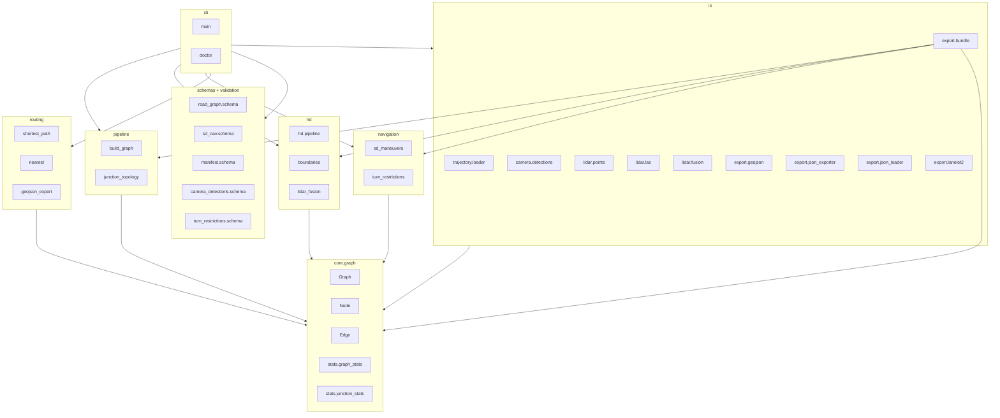
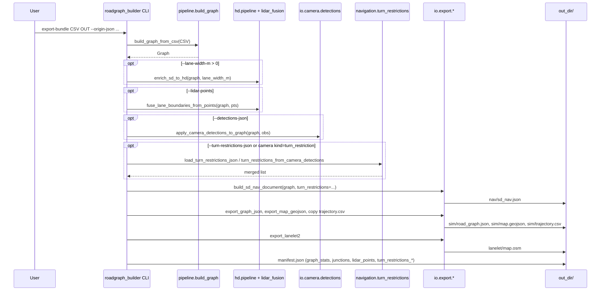
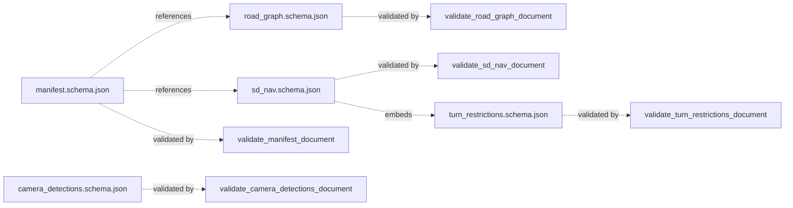
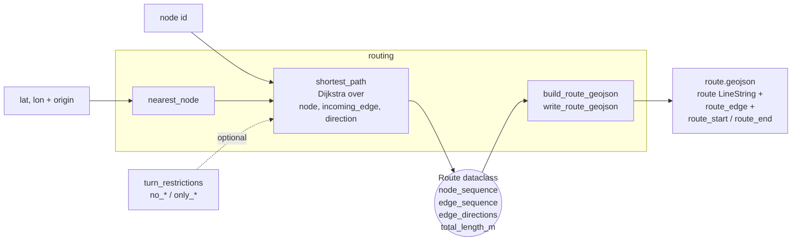
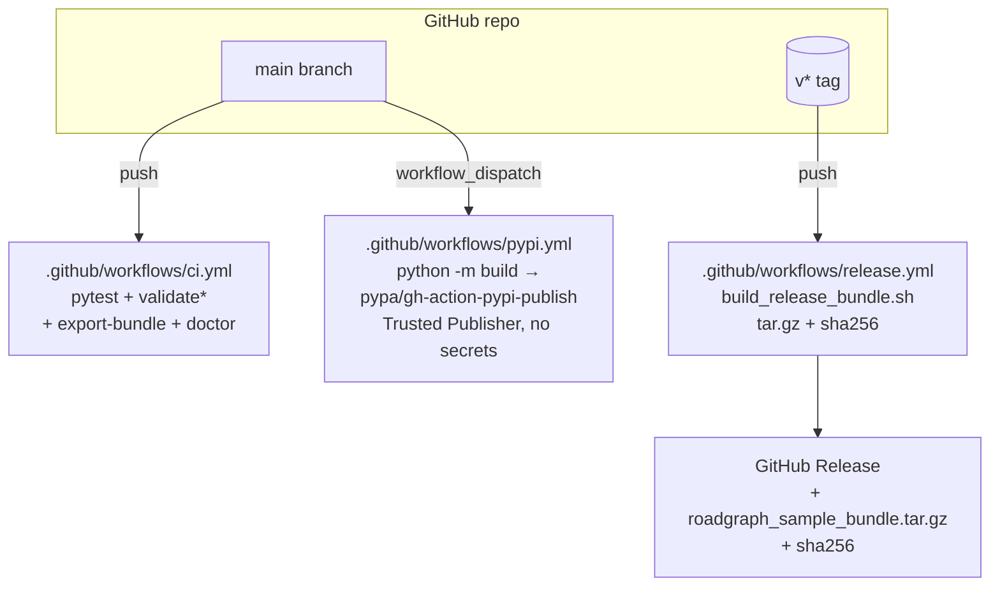

# roadgraph_builder — Architecture

A single-page map of how the pieces fit together. Skim the diagrams first,
then drop into the module index at the bottom. The intent is to give a new
contributor (or a future Codex session) enough context to know *where* to
change things.

## High-level data flow

Inputs enter from the left; the three export targets and the interactive
viewer live on the right. Optional stages are dashed.

```mermaid
flowchart LR
    subgraph Inputs
        T[Trajectory CSV<br/>timestamp,x,y]
        O[Origin JSON<br/>lat0,lon0]
        D[Camera detections JSON<br/>observations: edge_id, kind, ...]
        L[LiDAR points<br/>CSV or LAS/LAZ]
        R[Turn restrictions JSON<br/>manual or sd_nav shape]
    end

    T --> B[build<br/>pipeline.build_graph]
    B --> G((Graph<br/>nodes, edges<br/>metadata.map_origin))

    G -->|lane_width_m > 0| E[enrich<br/>hd.pipeline]
    E --> G

    L -. optional .-> F[fuse-lidar<br/>hd.lidar_fusion]
    F -. attributes.hd.lane_boundaries .-> G

    D -. optional .-> C[apply-camera<br/>io.camera.detections]
    C -. attributes.hd.semantic_rules .-> G

    R -. optional .-> TR[turn_restrictions<br/>navigation.turn_restrictions]
    TR -. merged list .-> NAV

    G --> NAV[nav/sd_nav.json<br/>topology + lengths<br/>allowed_maneuvers<br/>turn_restrictions]
    G --> SIM[sim/road_graph.json<br/>sim/map.geojson<br/>sim/trajectory.csv]
    G --> LL[lanelet/map.osm<br/>OSM XML 0.6]
    G --> MAN[manifest.json<br/>graph_stats, junctions,<br/>lidar_points, turn_restrictions_*]

    O --> B
    O --> NAV
    O --> SIM
    O --> LL

    SIM --> V[docs/map.html<br/>Leaflet viewer<br/>JS Dijkstra click-to-route]
```

## Packages



## CLI surface

Every subcommand maps to a tight slice of the library. The CLI itself is a
thin argparse dispatcher in `roadgraph_builder/cli/main.py`.

| Command | Reads | Writes / emits | Library entry point |
| --- | --- | --- | --- |
| `doctor` | repo cwd, package resources | stdout summary; exit 1 on schema/LAS failure | `cli.doctor.run_doctor` |
| `build` | trajectory CSV | road_graph JSON | `pipeline.build_graph.build_graph_from_csv` |
| `visualize` | trajectory CSV | SVG | `viz.svg_export.write_trajectory_graph_svg` |
| `validate` / `validate-detections` / `validate-sd-nav` / `validate-manifest` / `validate-turn-restrictions` | a JSON doc | — (exit 0 / 1) | `validation.*_document` |
| `enrich` | road_graph JSON | road_graph JSON with `metadata.sd_to_hd` / `attributes.hd` | `hd.pipeline.enrich_sd_to_hd` |
| `fuse-lidar` | road_graph + CSV/LAS/LAZ points | road_graph JSON with per-edge boundaries | `hd.lidar_fusion.fuse_lane_boundaries_from_points` |
| `apply-camera` | road_graph + detections JSON | road_graph JSON with `attributes.hd.semantic_rules` | `io.camera.detections.apply_camera_detections_to_graph` |
| `export-lanelet2` | road_graph + origin | OSM XML 0.6 | `io.export.lanelet2.export_lanelet2` |
| `export-bundle` | trajectory + origin (+ optional detections / LAS / turn_restrictions) | `nav/`, `sim/`, `lanelet/`, `manifest.json` | `io.export.bundle.export_map_bundle` |
| `inspect-lidar` | `.las` | LAS header JSON | `io.lidar.las.read_las_header` |
| `stats` | road_graph | `{graph_stats, junctions}` JSON | `core.graph.stats.graph_stats` / `junction_stats` |
| `nearest-node` | road_graph + query point | `{node_id, distance_m, query_xy_m}` JSON | `routing.nearest.nearest_node` |
| `route` | road_graph + (node ids or lat/lon) + optional restrictions | route JSON (+ optional GeoJSON via `--output`) | `routing.shortest_path` / `routing.geojson_export.write_route_geojson` |

## `export-bundle` internals



## Bundle directory

```text
<out_dir>/
├── README.txt
├── manifest.json            # provenance + graph_stats + junctions + turn_restrictions_*
├── nav/
│   └── sd_nav.json          # topology + allowed_maneuvers(_reverse) + turn_restrictions
├── sim/
│   ├── README.txt
│   ├── road_graph.json      # full graph (nodes, edges with hd + attributes)
│   ├── map.geojson          # WGS84 FeatureCollection (trajectory, centerlines, boundaries, nodes)
│   └── trajectory.csv       # verbatim copy of the input
└── lanelet/
    └── map.osm              # OSM XML 0.6 with roadgraph:* tags + optional lanelet relations
```

## Schema graph

Every written artefact has a JSON Schema under `roadgraph_builder/schemas/`
and a validator in `roadgraph_builder/validation/`.



`sd_nav.schema.json` inlines the same per-item shape that
`turn_restrictions.schema.json` wraps, so a manual
`{turn_restrictions: [...]}` file validates with either validator.

## Routing subsystem



The Leaflet viewer (`docs/map.html`) ships a second, smaller Dijkstra in
JavaScript that reads the `start_node_id` / `end_node_id` / `length_m`
properties now emitted on every centerline feature, so click-to-route
works entirely client-side.

## Distribution & CI



## Module index

| Path | Purpose |
| --- | --- |
| `roadgraph_builder/core/graph/{graph,node,edge,stats}.py` | In-memory Graph / Node / Edge + stat helpers |
| `roadgraph_builder/pipeline/build_graph.py` | Trajectory → polylines → merged-endpoint graph (drops degenerate self-loops) |
| `roadgraph_builder/pipeline/junction_topology.py` | Classifies multi_branch nodes into `t_junction` / `y_junction` / `crossroads` / `x_junction` / `complex_junction` |
| `roadgraph_builder/hd/pipeline.py`, `boundaries.py` | SD→HD envelope, centerline-offset lane boundaries |
| `roadgraph_builder/hd/lidar_fusion.py` | Per-edge proximity + binned median boundaries from XY point sets |
| `roadgraph_builder/io/trajectory/loader.py` | Trajectory CSV reader (`timestamp,x,y`) |
| `roadgraph_builder/io/camera/detections.py` | Load + apply camera detections (`semantic_rules` on edges) |
| `roadgraph_builder/io/lidar/points.py` | XY CSV loader |
| `roadgraph_builder/io/lidar/las.py` | LAS 1.0–1.4 public-header reader + X/Y numpy loader; LAZ dispatch via `laspy` when the `[laz]` extra is installed |
| `roadgraph_builder/io/export/geojson.py` | WGS84 `FeatureCollection` writer (trajectory, centerlines with `start_node_id`/`end_node_id`/`length_m`, HD boundaries, nodes) |
| `roadgraph_builder/io/export/json_exporter.py`, `json_loader.py` | Round-trip road graph JSON |
| `roadgraph_builder/io/export/lanelet2.py` | OSM XML 0.6 exporter with `roadgraph:*` tags and optional lanelet relations |
| `roadgraph_builder/io/export/bundle.py` | `export_map_bundle` — the three-way export + manifest |
| `roadgraph_builder/navigation/sd_maneuvers.py` | Geometry-only `allowed_maneuvers(_reverse)` at each digitized end node |
| `roadgraph_builder/navigation/turn_restrictions.py` | Loader + camera extraction + merge for `sd_nav.turn_restrictions` |
| `roadgraph_builder/routing/shortest_path.py` | Directed-state Dijkstra that honours `no_*` / `only_*` restrictions |
| `roadgraph_builder/routing/nearest.py` | `nearest_node` (xy or lat/lon) |
| `roadgraph_builder/routing/geojson_export.py` | Route → GeoJSON FeatureCollection |
| `roadgraph_builder/schemas/*.schema.json` | JSON Schemas shipped as package resources |
| `roadgraph_builder/validation/*.py` | One `validate_*_document` per schema (Draft 2020-12) |
| `roadgraph_builder/viz/svg_export.py` | Map-like SVG for the `visualize` command |
| `roadgraph_builder/cli/main.py` | argparse dispatcher for every subcommand |
| `roadgraph_builder/cli/doctor.py` | Install / asset self-check |
| `docs/map.html` | Leaflet viewer with dataset dropdown + click-to-route |
| `scripts/` | Fetch, refresh, build, demo, tune shell helpers |
| `.github/workflows/` | CI, release-on-tag, PyPI workflow_dispatch |

## Further reading

- [`docs/PLAN.md`](PLAN.md) — roadmap, facts vs. intent, handoff pointers.
- [`docs/bundle_tuning.md`](bundle_tuning.md) — parameter sweep recipe (includes the Paris OSM observations).
- [`docs/navigation_turn_restrictions.md`](navigation_turn_restrictions.md) — regulation-vs-geometry design + how to provide turn restrictions.
- [`docs/handoff/turn_restrictions.md`](handoff/turn_restrictions.md), [`docs/handoff/release_distribution.md`](handoff/release_distribution.md) — Codex hand-off prompts, both marked DONE.
- [`CHANGELOG.md`](../CHANGELOG.md) — dated feature log.
