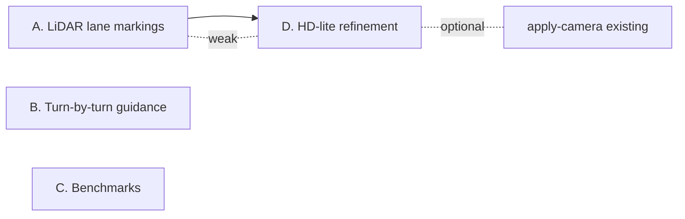

# roadgraph_builder v0.5.0 — 実装計画（Codex 向け）

**前提:** v0.4.0 は 2026-04-19 にリリース済み。`main` の `[Unreleased]` は空。
このファイルは v0.5.0 の 4 機能の **実装仕様** を Codex がそのまま着手できる
粒度で書いたもの。ひとつの機能を 1 コミット／1 PR 単位で落とす前提。

## 全体方針

- **独立性優先:** A と D には弱い依存（D が A の出力を利用可）。
  それ以外の順序制約は無い。A → B → C → D の順で並列着手可能。
- **後方互換:** 既存 CLI・スキーマ破壊なし。
  新 CLI サブコマンド／新スキーマファイルとして追加する。
  既存 `manifest.json` / `sd_nav.json` / `road_graph.json` に新フィールドを
  **追加するだけ**（`additionalProperties: true` の箇所に）なら OK、
  必須化は v0.6.0 以降。
- **テスト:** 各機能は `tests/test_<feature>_*.py` を 1 本以上追加し、
  CI の `pytest` で通ること。合成データで決定的に落ちる assertion を書く。
- **CHANGELOG:** 各機能の実装 PR で `[Unreleased]` の `### Added` に
  新 CLI 名＋一行説明を足す。最後に release prep が `[0.5.0] — YYYY-MM-DD`
  へ畳む（v0.4.0 リリースプロセス参照）。
- **コミットメッセージ:** `feat(<scope>): <題> / chore(...) / docs(...)` の
  単一トピック形式。Co-Authored-By・AI マーカー禁止。

## A. LiDAR intensity-based lane marking detection

### ゴール

路面ペイント（白線・黄線）は LiDAR intensity が周囲路面より有意に高いという
物理を使い、既にある LAS/LAZ loader の上に **車線中心候補** と **車線境界
候補（左右）** を per-edge で推定するパスを足す。現行の `fuse-lidar` は
「点群から幾何境界を作る」だが、新パスは「点群から *塗装位置* を作る」。

### 実装

新モジュール: `roadgraph_builder/io/lidar/lane_marking.py`

```python
from dataclasses import dataclass
import numpy as np

@dataclass(frozen=True)
class LaneMarkingCandidate:
    edge_id: str
    side: str                          # "left" | "right" | "center"
    polyline_m: list[tuple[float, float]]
    intensity_median: float
    point_count: int

def detect_lane_markings(
    graph_json: dict,
    points_xyz_i: np.ndarray,          # (N, 4): x, y, z, intensity
    *,
    max_lateral_m: float = 2.5,
    intensity_percentile: float = 85.0,
    along_edge_bin_m: float = 1.0,
    min_points_per_bin: int = 3,
) -> list[LaneMarkingCandidate]:
    """Per-edge intensity-peak extraction.

    Algorithm (deterministic, no ML):
    1. For each edge, snap all points within `max_lateral_m` of the
       centerline. Project each point to (s, t) along/across the edge.
    2. Compute global intensity threshold = `intensity_percentile`-th
       percentile across snapped points for the edge.
    3. Bin along s at `along_edge_bin_m`. In each bin, select points
       above threshold and cluster by t (1-D agglomerative: gaps > 0.5 m
       split). Each cluster whose median intensity is still above the
       threshold becomes a candidate row.
    4. For rows forming continuous sequences (>= 5 bins), emit a
       LaneMarkingCandidate with side tagged by sign of median t
       (left = t > 0.5 m, right = t < -0.5 m, center = |t| < 0.5 m).
    """
```

CLI: `roadgraph_builder detect-lane-markings graph.json points.las --output lane_markings.json`

### スキーマ

`roadgraph_builder/schemas/lane_markings.schema.json`

```json
{
  "$schema": "https://json-schema.org/draft/2020-12/schema",
  "title": "lane_markings.json",
  "type": "object",
  "required": ["candidates"],
  "properties": {
    "candidates": {
      "type": "array",
      "items": {
        "type": "object",
        "required": ["edge_id", "side", "polyline_m"],
        "properties": {
          "edge_id": {"type": "string"},
          "side": {"enum": ["left", "right", "center"]},
          "polyline_m": {
            "type": "array",
            "items": {"type": "array", "items": {"type": "number"}, "minItems": 2, "maxItems": 2}
          },
          "intensity_median": {"type": "number"},
          "point_count": {"type": "integer"}
        }
      }
    }
  }
}
```

### 受け入れ条件

- [ ] `detect-lane-markings` CLI が `--help` で出る。
- [ ] 合成 LAS（`scripts/make_sample_lane_las.py` 新規、左右 1.75 m
      オフセットに intensity 200 の点列、路面 intensity 50）を投入し、
      left / right 2 候補を 10 cm 以内で回収する regression テスト。
- [ ] `validate-lane-markings` スキーマ検証 CLI。
- [ ] `doctor` のスキーマ自己チェックに `lane_markings.schema.json` を追加。

### テスト

- `tests/test_lane_marking_synthetic.py` — 合成 LAS round-trip。
- `tests/test_lane_marking_cli.py` — CLI smoke。

### 非目標

- 実 LAS（mvk-thin 等）での精度チューニング。v0.6.0 以降。
- カーブ区間でのペイント追従（直線優先で十分）。
- 破線・実線の分類（candidate はフラット配列）。

---

## B. Turn-by-turn navigation guidance

### ゴール

`route` CLI が出す `route.geojson` と `sd_nav.json` を入力に、
ナビアプリが読むような **逐次命令シーケンス** を生成する。
既存の `junction_type` / `allowed_maneuvers` と geometry から
maneuver カテゴリを推定する。

### 実装

新モジュール: `roadgraph_builder/navigation/guidance.py`

```python
from dataclasses import dataclass, field

@dataclass(frozen=True)
class GuidanceStep:
    step_index: int
    edge_id: str
    start_distance_m: float              # route start からの累積距離
    length_m: float
    maneuver_at_end: str                 # see MANEUVER_CATEGORIES
    heading_change_deg: float            # + 右 / − 左
    junction_type_at_end: str | None
    description: str                     # human-readable
    sd_nav_edge_maneuvers: list[str]     # sd_nav.allowed_maneuvers 参照

MANEUVER_CATEGORIES = (
    "depart", "arrive",
    "straight",
    "slight_left", "left", "sharp_left",
    "slight_right", "right", "sharp_right",
    "u_turn",
    "continue",
)

def build_guidance(
    route_geojson: dict,
    sd_nav: dict,
    *,
    slight_deg: float = 20.0,
    sharp_deg: float = 120.0,
    u_turn_deg: float = 165.0,
) -> list[GuidanceStep]:
    ...
```

CLI: `roadgraph_builder guidance route.geojson sd_nav.json --output guidance.json`

### スキーマ

`roadgraph_builder/schemas/guidance.schema.json` — steps 配列、各 step は上記
dataclass をシリアライズしたもの。

### 受け入れ条件

- [ ] `guidance` CLI が Paris grid bundle の `route_paris_grid.geojson` +
      その bundle の `sd_nav.json` を食って JSON を吐く。
- [ ] depart → N × (straight/left/right/...) → arrive の順序が保たれる
      regression テスト。
- [ ] 合成 L 字ルート（1 右折）で `heading_change_deg` が +90 ± 2°、
      maneuver が `right` になる decisive test。
- [ ] 左右対称の確認: 同じ geometry を反転すると heading 符号反転、
      maneuver が `left` に切り替わる。
- [ ] `validate-guidance` スキーマ検証 CLI。

### テスト

- `tests/test_guidance_categories.py` — 境界値（`slight_deg` / `sharp_deg` /
  `u_turn_deg`）を跨ぐ合成ルート。
- `tests/test_guidance_roundtrip_paris.py` — 実データ end-to-end。

### 非目標

- 距離の unit 文字列化（"120 m", "0.3 km"）。caller 側責務。
- TTS 合成 / i18n。`description` は英語固定で簡潔（"Turn right onto e42"）。
- Lane-level guidance（"Use the second lane from right"）。HD 完成後。

---

## C. Performance benchmarks

### ゴール

グラフサイズが大きくなったときの **スケーリング特性** を定量化する。
リグレッションで 2× 以上遅くなったら CI 側で気付ける回帰防止を置く。

### 実装

新 script: `scripts/run_benchmarks.py`

```python
import time, json, statistics

BENCHMARKS = {
    "polylines_to_graph_paris": (build_paris_graph, 1),
    "polylines_to_graph_10k_synth": (build_10k_synth, 3),
    "shortest_path_paris": (run_paris_routes_100, 1),
    "export_bundle_end_to_end": (export_bundle_paris, 1),
}

def main() -> int:
    results = {}
    for name, (fn, warmup) in BENCHMARKS.items():
        for _ in range(warmup):
            fn()
        t = [time.perf_counter()]
        fn()
        t.append(time.perf_counter())
        results[name] = {"elapsed_s": t[1] - t[0]}
    print(json.dumps(results, indent=2))
```

CLI は不要（script 直接起動）。Make target: `make bench`。

### ドキュメント

`docs/benchmarks.md` — 定期取得した数値を表で。初回ベースラインを v0.5.0
リリース時の `a17b5a5` (v0.4.0) で取って記録する。

### CI

`.github/workflows/bench.yml` — opt-in（`workflow_dispatch` のみ）。
`pytest-benchmark` は入れない（追加依存を避けて script だけで十分）。

### 受け入れ条件

- [ ] `make bench` が 60 秒以内に終わる。
- [ ] `scripts/run_benchmarks.py --baseline baseline.json` で比較モード、
      +200% 劣化があれば exit 1。
- [ ] `docs/benchmarks.md` に初回測定表（machine spec + wall time）。

### テスト

- `tests/test_benchmark_script.py` — script import + 小さい合成入力で
  smoke（wall time は assertion しない、exit 0 だけ）。

### 非目標

- メモリプロファイル（tracemalloc 等）。CPU のみ。
- CI 毎 push 実行。ノイズでフレーキーになるため `workflow_dispatch` 限定。

---

## D. HD-lite 精度強化（multi-source refinement）

### ゴール

現行 `enrich_sd_to_hd` は単純な車線幅オフセット。v0.5.0 ではそこに
**複数ソースの実観測から per-edge で幅／中心オフセットを補正** するレイヤを
足す。ソース: (1) `attributes.trace_stats`（trace 横方向ジッタ）、(2) A の
lane markings（存在すれば）、(3) camera detections（存在すれば）。
得られた per-edge refinement を `metadata.hd_refinement` に記録し、
`centerline_lane_boundaries` の半幅を edge 単位で可変にする。

### 実装

新モジュール: `roadgraph_builder/hd/refinement.py`

```python
from dataclasses import dataclass

@dataclass(frozen=True)
class EdgeHDRefinement:
    edge_id: str
    base_half_width_m: float
    refined_half_width_m: float
    centerline_offset_m: float        # 中心線をどちらに動かしたか
    sources_used: list[str]           # ["traces", "lane_markings", "camera"]
    confidence: float                 # 0.0 – 1.0

def refine_hd_edges(
    graph_json: dict,
    *,
    lane_markings: dict | None = None,
    camera_detections: dict | None = None,
    base_lane_width_m: float = 3.5,
) -> list[EdgeHDRefinement]:
    ...
```

`roadgraph_builder/hd/pipeline.py::enrich_sd_to_hd` に `refinements`
引数を追加し、受けた refinement を per-edge に適用。後方互換のため
`refinements=None` で従来動作。

CLI 拡張: `enrich` に `--lane-markings-json` / `--camera-detections-json`
フラグを追加し、内部で `refine_hd_edges` を呼ぶ。`export-bundle` も同様に
optional で受ける。

### 受け入れ条件

- [ ] `enrich --lane-markings-json` で左右幅が per-edge に反映される
      regression テスト（合成: edge A は幅 3.0 m、edge B は 4.0 m）。
- [ ] `sources_used` に使われたソース名が全て入る。
- [ ] `confidence` は (a) ソース数 × (b) 観測 bin 数の単調増加関数である
      ことを unit test で確認。
- [ ] 既存 `test_hd_pipeline*` が無変更で通る（後方互換）。

### テスト

- `tests/test_hd_refinement_synthetic.py` — 各ソース単独 & 混合での refinement。
- `tests/test_hd_refinement_bundle_integration.py` — `export-bundle` 経由。

### 非目標

- 動的な車線数推定（1/2/3 車線を判別）。v0.6.0 以降。
- 縦断勾配（z 方向）。2D のみ。

---

## 依存関係



並列で着手可能。D の acceptance に A 出力は必須ではない（`lane_markings=None`
でも traces のみで動く）ので A が先でも D 先でも問題ない。

## リリース手順（v0.5.0 prep）

全機能 merge 後:

1. `roadgraph_builder/__init__.py` + `pyproject.toml` を `0.5.0` に bump。
2. CHANGELOG `[Unreleased]` → `[0.5.0] — YYYY-MM-DD` へ畳む。
3. README の "Latest release" 等があれば 0.5.0 に更新。
4. `docs/PLAN.md` の 未確認欄を整理。
5. `chore(release): prepare 0.5.0` 単発コミット。
6. ユーザーに tag push を明示認可してもらう（`feedback_push_and_tags.md`）。
7. `git tag -a v0.5.0 -m "Release 0.5.0" && git push origin v0.5.0`。
8. `release.yml` が自動で GitHub Release + tarball + sha256 を付ける。

## 関連ドキュメント

- `docs/PLAN.md` — プロジェクト全体の「確認済み・未確認」
- `docs/ARCHITECTURE.md` — Mermaid でのパッケージ地図
- `docs/bundle_tuning.md` — `export-bundle` パラメータ調整の知見
- `docs/navigation_turn_restrictions.md` — B の前提になる既存規制設計
- `docs/camera_pipeline_demo.md` — D の camera ソースの既存レシピ
