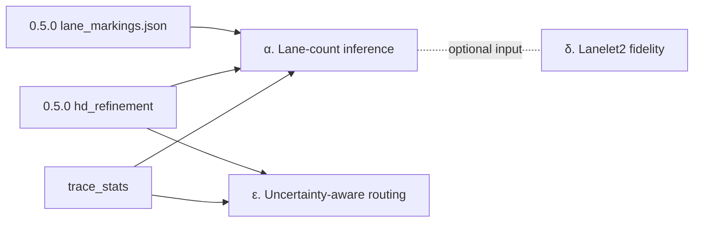

# roadgraph_builder v0.6.0 — 実装計画（Sonnet/Codex 向け）

**前提:** v0.5.0 は 2026-04-20 にリリース済み（4 features: `detect-lane-markings`, `guidance`, `make bench`, HD-lite multi-source refinement）。`main` の `[Unreleased]` は空。

**テーマ:** *HD-lite closes the loop*。0.5.0 までで **車線塗装位置** と **per-edge 信頼度** は出るようになったので、0.6.0 ではそれらを使って **車線数** を推定し、Lanelet2 出力を **本物の消費可能物** に昇格させ、routing が **観測品質を反映** するところまで閉じる。

## 機能サマリ

| 機能 | 新 / 拡張 CLI | 主モジュール |
| --- | --- | --- |
| α. Lane-count inference + multi-lane HD | `infer-lane-count`（新）+ `export-lanelet2 --per-lane`（拡張） | `roadgraph_builder/hd/lane_inference.py`（新）、`io/export/lanelet2.py`（拡張） |
| δ. Lanelet2 fidelity upgrade | `validate-lanelet2-tags`（新、CLI smoke） | `roadgraph_builder/io/export/lanelet2.py`（拡張） |
| ε. Uncertainty-aware routing | `route --prefer-observed` / `--min-confidence`（拡張） | `roadgraph_builder/routing/shortest_path.py`（拡張） |

## 全体方針

- **独立性:** α → (δ ⨯ ε) 並列。δ は α の per-lane 出力を優先消費できるが、α 未完了でも従来 1-lanelet/edge 出力でフォールバック可能。ε は α/δ に依存せず `trace_stats` / `hd_refinement` だけで動く。
- **後方互換:** CLI 既存フラグは全て維持。新フラグはデフォルトで従来挙動を保つ（`--per-lane` 未指定なら現状の 1-lanelet/edge）。スキーマは追加のみ（`road_graph.schema.json` に optional `attributes.hd.lane_count` / `lanes[]` を足すだけ、必須化は 0.7.0 以降）。
- **テスト:** 0.5.0 の 303 passed + 3 skipped ラインをキープ。各機能で `tests/test_<feature>_*.py` を 1 本以上追加。
- **CHANGELOG:** 各実装 PR で `[Unreleased]` の `### Added` / `### Changed` に一行追記。release prep で `[0.6.0] — YYYY-MM-DD` に畳む。
- **コミットメッセージ:** `feat(<scope>): <題>` / `chore(...)` / `docs(...)` の単一トピック。Co-Authored-By・AI マーカー禁止。

---

## α. Lane-count inference + multi-lane HD

### ゴール

0.5.0 の `lane_markings.json`（left / right / center candidates）と `attributes.trace_stats` の横方向分布から、per-edge の **車線数** と **各車線の中心線 / 境界** を推定する。結果を `attributes.hd.lane_count` と `attributes.hd.lanes[]` に格納し、Lanelet2 export で 1 lanelet per lane に展開できるようにする。

### アルゴリズム（決定的、ML 非使用）

1. 入力: road graph + optional lane_markings.json + optional trace_stats。
2. 各 edge で:
   - **候補幅分布の収集:** `hd_refinement.refined_half_width_m` が効いていればそれ × 2 をベース width、なければ `base_lane_width_m * max(1, round(observed_lateral_spread / base_lane_width_m))`。
   - **塗装マーカー位置のクラスタリング:** lane_markings の (edge_id, lateral_offset) を 1-D agglomerative（gap > `split_gap_m`, default 2.0 m）。連続クラスタを境界線と見なし、間を lane と数える。
   - **trace 横位置ヒストグラム（fallback）:** lane_markings 欠落時は、`trace_stats.perpendicular_offsets`（0.5.0 refinement で既に計算済み）から lateral mode を抽出、mode 数 = 推定車線数。
   - **各 lane の centerline:** 元 edge polyline を横にオフセットした列。lane 数が偶数なら対称、奇数なら中央 lane がエッジ中心に整合。
3. 出力（`attributes.hd`):
   ```json
   {
     "lane_count": 2,
     "lanes": [
       {"lane_index": 0, "offset_m": -1.75, "centerline_m": [[x,y],...], "confidence": 0.84},
       {"lane_index": 1, "offset_m": +1.75, "centerline_m": [[x,y],...], "confidence": 0.78}
     ],
     "lane_inference_sources": ["lane_markings", "trace_stats"]
   }
   ```

### 実装

新モジュール: `roadgraph_builder/hd/lane_inference.py`

```python
from dataclasses import dataclass, field
from typing import Sequence

@dataclass(frozen=True)
class LaneGeometry:
    lane_index: int                    # 0 = leftmost per digitized direction
    offset_m: float                    # signed lateral offset from centerline
    centerline_m: list[tuple[float, float]]
    confidence: float

@dataclass(frozen=True)
class EdgeLaneInference:
    edge_id: str
    lane_count: int                    # 1, 2, 3, ...
    lanes: list[LaneGeometry]
    sources_used: list[str]            # "lane_markings" / "trace_stats" / "default"

def infer_lane_counts(
    graph_json: dict,
    *,
    lane_markings: dict | None = None,
    base_lane_width_m: float = 3.5,
    split_gap_m: float = 2.0,
    min_lanes: int = 1,
    max_lanes: int = 6,
) -> list[EdgeLaneInference]:
    ...
```

CLI: `roadgraph_builder infer-lane-count graph.json --lane-markings-json lane_markings.json --output graph_with_lanes.json`

`export-lanelet2` に `--per-lane` フラグを追加: 無ければ従来通り 1 lanelet per edge、有れば `attributes.hd.lanes` を読んで 1 lanelet per lane を出し、隣接 lane を `type=regulatory_element, subtype=lane_change`（許容方向）/ 実線なら禁止で繋ぐ。

### 受け入れ条件

- [ ] `infer-lane-count` CLI が `--help` で出る。
- [ ] 合成テスト: 塗装マーカーを 3 列（-3.5, 0, +3.5 m）に置いた edge に対し、`lane_count = 2`、`lanes[].offset_m` が `[-1.75, +1.75]` を返す。
- [ ] trace_stats のみの fallback: lateral_offsets が bimodal（mean ± 1.5 m）なら `lane_count = 2`、unimodal なら `lane_count = 1`。
- [ ] `export-lanelet2 --per-lane` で lanelet 数が `lane_count` の合計と一致。
- [ ] 既存 `export-lanelet2`（`--per-lane` なし）は 1-lanelet/edge のまま（後方互換）。
- [ ] `road_graph.schema.json` に `lane_count`（int）と `lanes[]`（object array）を optional で追加、`validate` が通る。

### テスト

- `tests/test_lane_inference_synthetic.py` — 合成マーカー / trace_stats バリエーション。
- `tests/test_lane_inference_cli.py` — CLI smoke + round-trip。
- `tests/test_export_lanelet2_per_lane.py` — `--per-lane` で lanelet count が lane_count の合計。

### 非目標

- 実データ（Paris OSM 等）での精度チューニング → 0.7.0。
- 左右通行慣習（right-hand traffic vs left）を考慮した進行方向決定 → 0.7.0。
- 分合流（taper lane / on-ramp）の車線増減 → 0.7.0。

---

## δ. Lanelet2 fidelity upgrade

### ゴール

現行 `io/export/lanelet2.py` は Lanelet2 互換 OSM XML を吐くが、実 Autoware/Apollo スタックが食うには tag 充足度が不足。本機能で、**speed_limit / right_of_way / lane_marking subtype / traffic_light の regulatory_element 構造** を Lanelet2 公式タグ規約どおりに出す。

### 具体的な変更点

1. **`speed_limit`**: `attributes.hd.semantic_rules[kind=speed_limit, value_kmh=X]` を持つ edge に対し、lanelet relation に
   ```
   <tag k="speed_limit" v="50"/>     <!-- km/h, unit omitted per L2 convention -->
   <tag k="type" v="lanelet"/>
   ```
   を追加。別解として lane の regulatory_element に `subtype=speed_limit` の relation を作る形（L2 spec 準拠）を選ぶ。
2. **`right_of_way`**: turn_restrictions.json の情報を lane 単位の `regulatory_element subtype=right_of_way` に変換、`role=right_of_way` と `role=yield` を正しく付与。
3. **`lane_marking`**: `attributes.hd.lane_boundaries` の境界線を way として出すとき、`type=line_thin` / `subtype=solid | dashed | solid_solid` タグを付ける。判別ルール: 塗装 lane_markings candidate の `intensity_median` が threshold 以上 + 連続長 / bin 数 で solid / dashed を区別（hack 的でも良い、FOLLOWUP で本物化）。
4. **`traffic_light` regulatory_element**: `camera_detections[kind=traffic_light]` を lane の regulatory_element として、`role=refers`（信号機 node）+ `role=ref_line`（停止線 way、存在すれば）+ `subtype=traffic_light` で出す。
5. **Metadata schema 拡張:** `metadata.lanelet2_tags` に使った仕様バージョン / 拡張タグ一覧を embed（downstream 消費者が feature detection できる）。

### 実装

`roadgraph_builder/io/export/lanelet2.py` を編集。新しいヘルパー:

```python
def _speed_limit_tags(semantic_rules: list[dict]) -> list[tuple[str, str]]: ...
def _lane_marking_subtype(boundary_candidates: list[dict] | None) -> str | None: ...
def _build_traffic_light_regulatory(...) -> Relation | None: ...
def _build_right_of_way_regulatory(turn_restriction: dict, lane_members: list) -> Relation | None: ...
```

CLI 拡張: `export-lanelet2` に
- `--speed-limit-tagging {lanelet-attr,regulatory-element}`（default: `regulatory-element`、L2 spec 準拠）
- `--lane-markings-json PATH`（solid/dashed 判別の材料）

新 CLI: `validate-lanelet2-tags out.osm`
- 出力 OSM を parse して `lanelet2_validation` が使えれば実行、
  使えなければ「必須タグが全 lanelet に存在するか」の簡易 check。
- 実装ヒント: `xml.etree.ElementTree` で `<relation type=lanelet>` を走査、
  `location` / `subtype` / `one_way` / `speed_limit` の抜け落ちを列挙。
- exit 1 on schema-level violations、exit 0 on warnings-only。

### 受け入れ条件

- [ ] `export-lanelet2 --speed-limit-tagging regulatory-element` で `speed_limit` が regulatory_element relation として出る。
- [ ] `export-lanelet2 --lane-markings-json` で boundary way の `subtype` が `solid` / `dashed` のどちらかになる。
- [ ] `traffic_light` detection 1 個で lanelet に regulatory_element relation が 1 個付き、`role=refers` の node と `type=traffic_light` の member を持つ。
- [ ] `validate-lanelet2-tags` の簡易 check が (a) 合格ケース (b) `subtype` 抜けの失敗ケース を区別する。
- [ ] 既存 `test_export_lanelet2.py` が通る（後方互換）。

### テスト

- `tests/test_lanelet2_fidelity_tags.py` — 各 tag の pass/fail round-trip。
- `tests/test_lanelet2_validate_cli.py` — `validate-lanelet2-tags` CLI smoke。

### 非目標

- Autoware 公式 `lanelet2_validation` を dependencies に入れる → しない（MIT + 依存最小の原則）。optional で外部 install しているユーザが使えれば良い。
- Lanelet2 XML の **完全** 互換 → 本機能のスコープは「主要タグが通る」まで。
- lanelet 間の接続 relation `lane_change` / `conflicting_lanelets` → α 側で扱う。

---

## ε. Uncertainty-aware routing

### ゴール

0.5.0 で `attributes.trace_stats.trace_observation_count` と `metadata.hd_refinement.confidence` が per-edge に出るようになった。0.6.0 ではこれを `shortest_path` のコストに反映し、user が **未観測な道より観測豊富な道を選ぶ** ことを明示的に選択可能にする。

### 実装

`roadgraph_builder/routing/shortest_path.py` にコスト乗算フック追加:

```python
def shortest_path(
    graph,
    from_node: str,
    to_node: str,
    *,
    turn_restrictions: list[dict] | None = None,
    # 0.6.0: optional cost hooks
    prefer_observed: bool = False,
    min_confidence: float | None = None,
    observed_bonus: float = 0.5,       # multiply cost by this when trace_observation_count > 0
    unobserved_penalty: float = 2.0,   # multiply cost by this when trace_observation_count == 0
) -> Route: ...
```

- `prefer_observed=True`: 各 edge の effective cost = `length_m * (observed_bonus if obs>0 else unobserved_penalty)`。
- `min_confidence=0.5`: `hd_refinement.confidence < 0.5` な edge は探索対象から除外（expand しない）。
- 両方指定可。両方 None（default）で従来動作（length-only cost）。

CLI `route` にフラグ追加:
- `--prefer-observed`
- `--min-confidence FLOAT`
- `--observed-bonus FLOAT`（default 0.5）
- `--unobserved-penalty FLOAT`（default 2.0）

### 受け入れ条件

- [ ] `--prefer-observed` で observed edge のみの経路を選ぶ合成テスト: 2 候補経路、片方は observed / 片方は未観測、length が同じなら observed を選ぶ。
- [ ] `--min-confidence 0.5` で confidence=0.3 の edge を含む経路を避ける。
- [ ] `--min-confidence` が厳しすぎて到達不能な場合 exit 1 + stderr メッセージ。
- [ ] `route` default 呼び出しは従来結果と完全に一致（regression）。

### テスト

- `tests/test_routing_uncertainty.py` — 合成 4-node graph で各フラグの効果を decisive に。
- `tests/test_routing_existing_behavior.py`（既存）が無変更で通ることを確認。

### 非目標

- 確率的 routing（Dijkstra → A*/Yen's k-shortest）→ 0.7.0。
- Cost function を user 定義の Python callable で差し替え → 0.7.0。

---

## 依存関係



- α は 0.5.0 の lane_markings + hd_refinement + trace_stats を入力に消費。
- δ は α の `attributes.hd.lanes[]` を優先消費、無ければ従来パス。
- ε は 0.5.0 の trace_stats + hd_refinement.confidence のみに依存、α/δ 不要。

並列着手可能。順序は **α → δ**（δ が α の利益を受けるため）、**ε は独立にいつでも**。

## リリース手順（v0.6.0 prep）

全機能 merge 後:

1. `roadgraph_builder/__init__.py` + `pyproject.toml` を `0.6.0` に bump。
2. CHANGELOG `[Unreleased]` → `[0.6.0] — YYYY-MM-DD` へ畳む。
3. README の "Latest release" / Features matrix を 0.6.0 に更新、新 CLI 3 本（`infer-lane-count` / `validate-lanelet2-tags`、`route` の新フラグ）のサブセクションを追記。
4. `docs/PLAN.md`:
   - 確認済み セクションに α/δ/ε の要約を追加。
   - リリース履歴 に `v0.6.0 (YYYY-MM-DD)` を足す。
5. `docs/ARCHITECTURE.md`:
   - `hd.lane_inference` を Packages Mermaid に追加。
   - CLI surface table に `infer-lane-count` / `validate-lanelet2-tags` / `route --prefer-observed` を追加。
   - Module index に `roadgraph_builder/hd/lane_inference.py` を追加。
6. `chore(release): prepare 0.6.0` 単発コミット。
7. ユーザーに tag push を明示認可してもらう（`feedback_push_and_tags.md`）。
8. `git tag -a v0.6.0 -m "Release 0.6.0" && git push origin v0.6.0`。
9. `release.yml` が自動で GitHub Release + tarball + sha256 を付ける。

## 関連ドキュメント

- `docs/PLAN.md` — 確認済み・未確認・リリース履歴。
- `docs/ARCHITECTURE.md` — Mermaid 地図 + CLI 表 + Module index。
- `docs/ROADMAP_0.5.md` — v0.5.0 の実装仕様（参考として残す）。
- `docs/bundle_tuning.md` — `export-bundle` のパラメータ調整。
- `docs/camera_pipeline_demo.md` — camera detections のデモレシピ。
- `docs/navigation_turn_restrictions.md` — turn_restrictions 設計。
