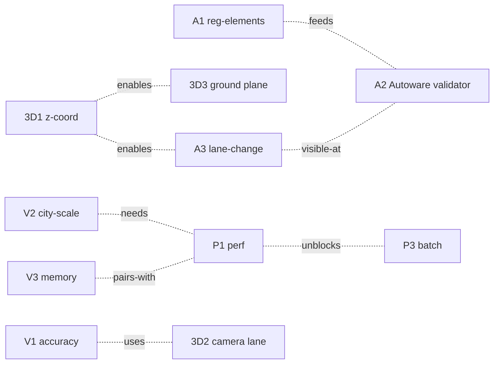

# roadgraph_builder v0.7.0 — 実装計画（Sonnet/Codex 向け）

**前提:** v0.6.0 は 2026-04-20 にリリース済み（3 features: `infer-lane-count` + per-lane Lanelet2 / Lanelet2 fidelity + `validate-lanelet2-tags` / uncertainty-aware routing）。`main` の `[Unreleased]` は空。

**テーマ:** *The Everything Release — production quality across perf / 3D / autonomy / real data*。v0.4→0.5→0.6 で機能面の縦幅を広げた（車線塗装 / ナビ案内 / HD-lite 補正 / 車線数推定 / Lanelet2 tag 充実 / 品質反映 routing）。0.7.0 では **性能・3 次元・Autoware 互換・実データ検証** の 4 方向から **深さ** を入れ、"demo 品質" → "production 品質" に持ち上げる。

## workstream サマリ

| # | ID | 機能 | 新 / 拡張 CLI | 主モジュール |
| --- | --- | --- | --- | --- |
| 1 | **P1** | X/T-junction split perf O(N²) → O(N log N) | — (build の高速化) | `pipeline/build_graph.py`, `pipeline/crossing_splitters.py` |
| 2 | **P2** | Incremental / streaming build | `update-graph`（新） | `pipeline/incremental.py`（新） |
| 3 | **P3** | Dataset-level batch CLI | `process-dataset`（新） | `cli/dataset.py`（新） |
| 4 | **3D1** | 3D / elevation throughout | `build --3d` / `export-lanelet2` 拡張 | `pipeline/build_graph.py`, `io/export/lanelet2.py`, schemas |
| 5 | **3D2** | Camera-only lane detection | `detect-lane-markings-camera`（新） | `io/camera/lane_detection.py`（新） |
| 6 | **3D3** | LiDAR ground-plane fitting (true 3D fuse) | `fuse-lidar --ground-plane` | `hd/lidar_fusion.py`（拡張） |
| 7 | **A1** | Full traffic_light / right_of_way / stop_line regulatory_element wiring | `export-lanelet2 --camera-detections-json` | `io/export/lanelet2.py`（拡張） |
| 8 | **A2** | Autoware `lanelet2_validation` round-trip | `validate-lanelet2` (既存 `validate-lanelet2-tags` と別、optional upstream) | `io/export/lanelet2_validator_bridge.py`（新） |
| 9 | **A3** | Lane-change routing + Lanelet2 lane_change relation | `route --allow-lane-change` | `routing/shortest_path.py`（拡張）, `io/export/lanelet2.py` |
| 10 | **V1** | Real-data α accuracy ground-truth campaign | `scripts/measure_lane_accuracy.py` | `scripts/`, `docs/accuracy_report.md` |
| 11 | **V2** | City-scale OSM regression tests | CI opt-in | `tests/test_city_scale.py`, `.github/workflows/city-bench.yml` |
| 12 | **V3** | Memory profile + optimization | `scripts/profile_memory.py` | `scripts/` |

**依存グラフ:**



**並列着手の推奨グループ分け:**

- **Group 1 (先着):** P1, 3D1, A1（他の多くが依存する土台）
- **Group 2 (並列):** P2, 3D2, 3D3, A2, A3（Group 1 完了後 or 非依存部分は先着可）
- **Group 3 (Group 1–2 が揃ってから):** P3, V1, V2, V3

## 全体ルール

- **後方互換:** 既存 CLI フラグは全て維持、新フラグはデフォルトで従来挙動を保つ。スキーマは optional 追加のみ。既存 303+3 / 376+3 passed ベースを regression させない。
- **コミット:** 1 機能 1 commit。`feat(<scope>): <題>` / `perf(...)` / `chore(...)` / `docs(...)`。Co-Authored-By・AI マーカー禁止。
- **CHANGELOG:** 実装 PR ごとに `[Unreleased]` に一行追記。release prep で `[0.7.0] — YYYY-MM-DD` に畳む。
- **外部依存追加禁止:** `lanelet2_validation` は optional（インストール時のみ使う）。NumPy / laspy（既存 extra）以外は足さない。
- **大データコミット禁止:** city-scale 用 OSM dump は `/tmp/`、derivatives（graph JSON, accuracy report）のみ commit。

---

## P1. X/T-junction split perf O(N²) → O(N log N)

### 背景

v0.5.0 ROADMAP の benchmark deviation で判明した通り、`split_polylines_at_crossings` / `split_polylines_at_t_junctions` は素朴な pair scan で O(N²)。10k 点 grid（50×50 = 2500 polyline 級）で 314 s かかり、benchmark を 10×10 grid に縮小する羽目になった。

### 実装

`roadgraph_builder/pipeline/crossing_splitters.py` 新規（or `build_graph.py` から切り出し）:

```python
def split_polylines_at_crossings_fast(
    polylines: list[list[tuple[float, float]]],
    *,
    grid_cell_m: float = 10.0,  # tuneable
) -> list[list[tuple[float, float]]]:
    """Uniform grid hashing + neighbor-bucket pair scan.

    Complexity target: O(N log N) in the number of polyline segments,
    assuming bounded segment length relative to grid_cell_m. Each
    segment hashes its bbox into grid cells; pair scan only compares
    segments sharing at least one cell.
    """
```

同じ idea を `split_polylines_at_t_junctions` にも適用。polyline 端点を KD-tree にして **interior projection nearest** を O(log N) で引く。

### 受け入れ条件

- [ ] `scripts/run_benchmarks.py` の `polylines_to_graph_10k_synth` を **50×50 grid に戻す**（元 2200 点 → 10000 点）。1 分 budget 内で完走。
- [ ] Paris 実データ（242 edge 級）で **結果が byte-identical** になること（regression test）。
- [ ] 合成 T 接続 / X 接続 / tip-to-tip ケースで既存動作と一致。

### テスト

- `tests/test_crossing_splitters_perf.py` — 10k grid で wall-time ≤ 30 s（CI でゆるめ）。
- `tests/test_crossing_splitters_byte_identical.py` — Paris graph を before/after で diff。

### 非目標

- 並列実行（GIL 制約・threading オーバヘッドで net 効かない）。
- Julia / Rust 書き換え。Python + NumPy で収める。

---

## P2. Incremental / streaming build — `update-graph`

### ゴール

既存 graph JSON に新しい trajectory CSV を **差分 merge** する CLI を新設。都市スケールで毎日走る車両のログを積み増すユースケース。

### 実装

`roadgraph_builder/pipeline/incremental.py`（新）:

```python
def update_graph_from_trajectory(
    graph_json: dict,
    new_trajectory_xy: list[tuple[float, float, float]],  # (timestamp, x, y)
    *,
    max_step_m: float = 25.0,
    merge_endpoint_m: float = 8.0,
    absorb_tolerance_m: float = 4.0,  # new polyline が既存 edge に近接したら吸収
) -> dict:
    """Add a new trajectory to an existing graph without full rebuild.

    Strategy:
      1. Polyline-ize the new trajectory (gap split like build_graph).
      2. For each new polyline, test whether it's fully absorbed by an
         existing edge (per-point lateral distance < absorb_tolerance_m
         for all points). If yes, bump `attributes.trace_observation_count`
         and skip edge creation.
      3. Otherwise run the X/T split + endpoint union-find locally on
         (new polyline × nearby existing edges) only — not a full
         polylines_to_graph rebuild.
      4. Emit a new graph JSON with new edges appended + updated
         node table.
    """
```

CLI: `roadgraph_builder update-graph existing.json new_trajectory.csv --output merged.json`

### 受け入れ条件

- [ ] 合成: 既存 1-edge graph に同一軌跡を update-graph すると **edge 数不変・`trace_observation_count` が +1**。
- [ ] 合成: 既存 graph の領域外 trajectory を update すると **edge が増える**。
- [ ] Paris: 全 trajectory で build した結果と、半分で build → 残り半分で update した結果が **topologically 同等**（edge 数 ±10% 以内・LCC 同等）。

### テスト

- `tests/test_incremental_absorb.py`, `tests/test_incremental_grow.py`, `tests/test_incremental_paris_halves.py`

### 非目標

- 並行 update（2 プロセスから同時に同じ graph 更新）。single-writer 前提。
- 削除 / 忘却（trajectory を取り除く逆操作）。0.8.0 以降。

---

## P3. Dataset-level batch CLI — `process-dataset`

### ゴール

ディレクトリ内の複数 trajectory CSV を **1 コマンドで** bundle 化。毎日 N 台の車両データがフォルダに落ちるユースケース。

### 実装

`roadgraph_builder/cli/dataset.py`（新）:

```python
def process_dataset(
    input_dir: Path,
    output_dir: Path,
    *,
    origin_json: Path | None,
    pattern: str = "*.csv",
    parallel: int = 1,
    continue_on_error: bool = True,
) -> dict:
    """Iterate CSV files, run export-bundle on each, aggregate stats.

    Emits:
      output_dir/
        <stem_1>/  (bundle)
        <stem_2>/
        ...
        dataset_manifest.json  (per-file status, aggregate graph_stats)
    """
```

CLI: `roadgraph_builder process-dataset input_dir/ output_dir/ --origin-json ... --pattern "*.csv" --continue-on-error`

### 受け入れ条件

- [ ] 3 ファイルのダミーディレクトリで 3 bundle + `dataset_manifest.json` が出る。
- [ ] 途中 1 ファイルだけ invalid（ヘッダ欠け）な場合、`--continue-on-error` でその 1 ファイルだけ skip、manifest に `status=failed` + error message。
- [ ] `--parallel 2` で複数 CPU 使用が確認できる（時間計測で）。

### テスト

- `tests/test_process_dataset_happy.py`, `tests/test_process_dataset_partial_failure.py`

### 非目標

- S3 / GCS 直読み（ローカル path のみ）。
- 分散 cluster 実行。

---

## 3D1. 3D / elevation throughout

### ゴール

trajectory の z 座標を受け付け、Graph / Edge / Lanelet2 出力まで通す。slope / grade を edge attribute に。

### 実装範囲（広域）

- **schema 拡張（optional）:** `road_graph.schema.json` の node / edge geometry を `[x, y]` or `[x, y, z]` 両対応に。
- **`io/trajectory/loader.py`:** `timestamp, x, y` に加えて `timestamp, x, y, z` を自動検出。
- **`pipeline/build_graph.py`:** 2D 版は現状維持、3D モード（`--3d` フラグ）で z も centerline に保持。
- **`hd/pipeline.py`:** slope = tan⁻¹(Δz / Δarc_length)。`attributes.slope_deg`（edge 単位）と `attributes.elevation_m`（node 単位）を追加。
- **`io/export/lanelet2.py`:** `ele` tag を node に追加（Lanelet2 公式 z タグ規約に合わせる）。
- **`routing/shortest_path.py`:** optional `uphill_penalty` / `downhill_bonus`（cost 乗算）を `--uphill-penalty` / `--downhill-bonus` で。

CLI: `build --3d`, `route --uphill-penalty`, `export-lanelet2` は自動で `ele` を出す。

### 受け入れ条件

- [ ] 2D CSV は従来通り動作（後方互換）。
- [ ] 3D CSV で Graph / GeoJSON / Lanelet2 出力に z 情報が残る。
- [ ] `attributes.slope_deg` が合成線形 10% 勾配で 5.71° 以内の誤差。
- [ ] `route --uphill-penalty 2.0` で登坂が避けられる合成テスト。

### テスト

- `tests/test_build_3d_roundtrip.py`, `tests/test_slope_inference.py`, `tests/test_lanelet2_elevation.py`, `tests/test_routing_slope_cost.py`

### 非目標

- 真の geoid 補正（EGM96 等）。平面近似 + z のみ。
- トンネル / 立体交差の自動判別。z 差 + spatial overlap で後続バージョン。

---

## 3D2. Camera-only lane detection

### ゴール

LiDAR 無しでも camera 画像から車線塗装を検出。既存の `CameraCalibration` + `pixel_to_ground` に、**pixel 空間での lane 検出** を追加。ML 非使用、pure NumPy の texture gradient + color threshold ヒューリスティック。

### 実装

`roadgraph_builder/io/camera/lane_detection.py`（新）:

```python
def detect_lanes_from_image_rgb(
    rgb: np.ndarray,  # HxWx3 uint8
    *,
    white_threshold: int = 200,
    yellow_hue_range: tuple[int, int] = (20, 40),
    saturation_min: int = 100,
    min_line_length_px: int = 30,
) -> list[LinePixel]:
    """Purely NumPy. HSV 変換 + color threshold + connected-component
    → 細長い塗装領域を返す。"""

def project_camera_lanes_to_graph_edges(
    image_lanes: list[LinePixel],
    calibration: CameraCalibration,
    graph_json: dict,
    pose_xy_m: tuple[float, float],
    heading_rad: float,
    *,
    max_edge_distance_m: float = 3.5,
) -> list[LaneMarkingCandidate]:
    """既存 pipeline.project_image_detections_to_graph_edges の lane 特化版。"""
```

CLI: `roadgraph_builder detect-lane-markings-camera graph.json calibration.json images/ --output camera_lanes.json`

### 受け入れ条件

- [ ] 合成 RGB（白線 2 本の上面図を wide-angle camera で再投影）から 2 lane candidate を ±0.3 m で回収。
- [ ] 既存 `demo_image_detections.json`（synthetic wide-angle）を流し、left/right lane が検出される。
- [ ] 夜間相当の暗い画像で white_threshold を下げると (true positive rate) ≥ 0.8、(false positive) ≤ 0.1 の合成テスト。

### テスト

- `tests/test_camera_lane_detection_synthetic.py`, `tests/test_camera_lane_to_edge_roundtrip.py`

### 非目標

- dashed lane の破線判別（solid のみ）。
- ML-based detector (LaneNet 等) への差し替え。interface だけ合わせる。

---

## 3D3. LiDAR ground-plane fitting (true 3D fuse)

### ゴール

現状 `fuse-lidar` は x,y だけ見る 2D binning。0.7.0 では LiDAR 点群から **RANSAC で地面平面** を fit、道路面上の高さ帯（+0.0 m ～ +0.3 m 位）だけを車線境界判定に使う。ノイズ（歩道・植生）が排除される。

### 実装

`roadgraph_builder/hd/lidar_fusion.py` に拡張:

```python
def fit_ground_plane_ransac(
    points_xyz: np.ndarray,  # (N, 3)
    *,
    max_iter: int = 200,
    distance_tolerance_m: float = 0.1,
    seed: int = 0,
) -> tuple[np.ndarray, float]:
    """Returns (normal_xyz, d). 平面方程式: normal · p + d = 0."""

def fuse_lane_boundaries_3d(
    graph_json: dict,
    points_xyz_i: np.ndarray,  # (N, 4) x,y,z,intensity
    *,
    height_band_m: tuple[float, float] = (0.0, 0.3),
    ...
) -> dict:
    """ground plane fit → band 内の点のみ既存 fuse_lane_boundaries を通す."""
```

CLI: `fuse-lidar --ground-plane` フラグ。未指定なら従来 2D 挙動。

### 受け入れ条件

- [ ] 合成: ground plane 点群（z=0）+ 植生ノイズ（z=2 m）+ 路面内 lane marking（z=0, high intensity）の入力に対し、`--ground-plane` で植生が除外される。
- [ ] RANSAC の normal が合成 10% 傾斜で ±2° 以内。
- [ ] 既存 `fuse-lidar` 呼び出し（`--ground-plane` なし）は byte-identical。

### テスト

- `tests/test_ground_plane_ransac.py`, `tests/test_fuse_lidar_3d.py`

### 非目標

- LiDAR 点群のマルチエコー / return number ベース fitration。
- 大規模 (>10M 点) での GPU RANSAC。

---

## A1. Full traffic_light / right_of_way / stop_line regulatory_element wiring

### ゴール

v0.6.0 δ で `_build_traffic_light_regulatory` / `_build_right_of_way_regulatory` を足したが main loop に接続していなかった。0.7.0 で `camera_detections.json` を `export-lanelet2` に渡せるようにして実 wiring を完了。

### 実装

`io/export/lanelet2.py` の `export_lanelet2` 関数に:

```python
def export_lanelet2(
    graph,
    ...,
    camera_detections: dict | None = None,        # NEW
    turn_restrictions: dict | None = None,        # NEW (既に graph にあれば不要)
) -> bytes:
    ...
```

CLI: `export-lanelet2 --camera-detections-json`, `--turn-restrictions-json` をサポート。

camera_detections の `kind` 別処理:
- `traffic_light` → regulatory_element `subtype=traffic_light`, `role=refers` + `role=ref_line` (停止線 way があれば)
- `stop_line` → `type=line_thin`, `subtype=solid` で way 出力 + 関連 lanelet の regulatory_element member に入れる
- `turn_restriction` （既存） → `subtype=yield` / `subtype=right_of_way` で regulatory_element

### 受け入れ条件

- [ ] 合成 `camera_detections.json` に `traffic_light` 1 + `stop_line` 1 を入れて `export-lanelet2 --camera-detections-json` を実行 → 出力に `subtype=traffic_light` regulatory_element 1 relation + `subtype=solid` way 1 本。
- [ ] `validate-lanelet2-tags` が errors=0 で通る。
- [ ] 既存 `export-lanelet2`（camera_detections なし）は byte-identical。

### テスト

- `tests/test_lanelet2_reg_elements_wiring.py`

### 非目標

- crossing / zebra の regulatory_element。
- lane-specific traffic_light（全 lanelet に共通で付与 → lane-specific は A3 の仕事）。

---

## A2. Autoware `lanelet2_validation` round-trip

### ゴール

Autoware 公式 lanelet2_validation ツールが通る出力にする。未インストール時は skip、入っていれば CI / local で自動検証。

### 実装

`roadgraph_builder/io/export/lanelet2_validator_bridge.py`（新）:

```python
def run_autoware_validator(osm_path: Path, timeout_s: int = 30) -> dict:
    """shell out to `lanelet2_validation --map-file ...` if available;
    parse stdout for error / warning counts. Return structured result."""
```

CLI: `validate-lanelet2 map.osm` — upstream validator を試す、errors=0 で exit 0、未インストール時は skip + warning。

### 受け入れ条件

- [ ] Autoware 未インストール環境で CLI が exit 0（skip メッセージ）。
- [ ] Autoware が PATH にあれば sample Paris grid Lanelet2 出力を feed して errors=0。
- [ ] 既知の errors が出る broken OSM を feed すると exit 1 + stderr に error 要約。
- [ ] `make test` は upstream 無しで通る。

### テスト

- `tests/test_lanelet2_autoware_validator.py`（skip when not installed）

### 非目標

- Autoware 本体を CI に入れる（重すぎる）。docker run ベースは 0.8.0。

---

## A3. Lane-change routing + Lanelet2 `lane_change` relation

### ゴール

`attributes.hd.lanes[]` を持つ edge の間を lane-level で routing し、Lanelet2 出力で隣接 lane 間に **`type=regulatory_element, subtype=lane_change`** relation を付ける（v0.6.0 α で lane 個別 lanelet は出せるようになっているが、それ同士の接続は作ってない）。

### 実装

`routing/shortest_path.py` 拡張:

```python
def shortest_path_lane_level(
    graph,
    from_node,
    to_node,
    *,
    allow_lane_change: bool = False,
    lane_change_cost_m: float = 50.0,
    ...
) -> Route:
    """directed state を (node, incoming_edge, direction, lane_index) に拡張。
    同一 edge 内の lane swap に lane_change_cost_m を足す。"""
```

CLI: `route --allow-lane-change`

`io/export/lanelet2.py`: `--per-lane` モードで 同 edge 内の隣接 lane を `subtype=lane_change` regulatory_element で接続、`sign=dashed` なら許可 / `sign=solid` なら禁止（3D2 / `detect-lane-markings --subtype` の情報活用）。

### 受け入れ条件

- [ ] 合成 2-lane edge を 1 本持つ graph で `route --allow-lane-change` が lane 0 → lane 1 を 1 step で辿れる。
- [ ] Lanelet2 出力に 1 `lane_change` relation 1 個。
- [ ] 既存 `route` は byte-identical（`--allow-lane-change` 未指定でエッジ単位の従来動作）。

### テスト

- `tests/test_routing_lane_change.py`, `tests/test_lanelet2_lane_change_relation.py`

### 非目標

- lane-change accelerate / decelerate の時系列モデル。step 数のみ。
- traffic 時間帯別コスト。

---

## V1. Real-data α accuracy ground-truth campaign

### ゴール

`infer-lane-count`（v0.6.0 α）の精度を **既知 ground truth** で測る。OSM の `lanes=` tag が入った都市 bbox を ground truth に、`infer-lane-count` の予測と比較、confusion matrix + MAE を `docs/accuracy_report.md` に記録。

### 実装

`scripts/measure_lane_accuracy.py`:

```python
def measure_lane_accuracy(
    graph_json: dict,           # infer-lane-count 済み
    osm_lanes_json: dict,       # Overpass から `way[lanes]`
    *,
    matching_tolerance_m: float = 5.0,
) -> dict:
    """edge centerline と OSM way を最近傍マッチ、lane_count を比較。"""
```

再現可能な fetch スクリプト + bbox list（Paris grid、Tokyo 銀座、Berlin Mitte 3 箇所）。

### 受け入れ条件

- [ ] 3 bbox 全て `infer-lane-count` → `measure_lane_accuracy` パイプが走る。
- [ ] `docs/accuracy_report.md` に confusion matrix (`1-lane actual` × `predicted 1/2/3/4+` 等) + MAE + 対象 edge 数。
- [ ] CI は **実行しない**（OSM fetch が重い）。手動 `make accuracy-report` のみ。

### テスト

- `tests/test_accuracy_measure_synthetic.py`（合成 GT + 合成予測で MAE 公式検証）

### 非目標

- 真値の正確性保証（OSM `lanes=` は人手入力で誤差あり）。あくまで relative ベースライン。
- ML training / fitting loop。測るだけ。

---

## V2. City-scale OSM regression tests

### ゴール

Tokyo 23 区 + Paris 20e arr. レベルの bbox（現状 bbox の 50× 面積）で `build-osm-graph` + `export-bundle` が完走することを保証。P1 の perf 効果が実感できるところ。

### 実装

`tests/test_city_scale.py` — pytest から `scripts/fetch_osm_highways.py` で bbox 引いて `/tmp/` に降ろし、`build-osm-graph` + `export-bundle` + `validate-manifest` をチェーン。assertion は:
- wall-time ≤ N 分（CI 側の timeout で決める、loose）
- edge 数 ≥ X（bbox ごとに閾値）
- 退化 self-loop = 0

`.github/workflows/city-bench.yml` — `workflow_dispatch` opt-in、Ubuntu-latest、月 1 回の schedule で回す。

### 受け入れ条件

- [ ] ローカル `pytest -m city_scale` で 3 都市全て完走（30 分以内）。
- [ ] CI の手動トリガーで Tokyo bbox が完走、failure 時には metrics を issue に post。
- [ ] 通常 `pytest` は `-m "not city_scale"` で city_scale を skip（既存 test 一切影響なし）。

### テスト

- 自身がテスト。

### 非目標

- multi-city routing。build のみ。

---

## V3. Memory profile + optimization

### ゴール

大 graph (100k edges クラス) のメモリ使用量を可視化、ホットスポット 1-2 箇所を潰す。`tracemalloc` で計測、最適化案をコメントで残す。

### 実装

`scripts/profile_memory.py`:

```python
import tracemalloc

def profile_build_and_bundle(csv_path, out_dir):
    tracemalloc.start()
    # build + enrich + export-bundle
    snapshot1 = tracemalloc.take_snapshot()
    ... # 操作
    snapshot2 = tracemalloc.take_snapshot()
    top_stats = snapshot2.compare_to(snapshot1, 'lineno')
    # top 20 を JSON で出す
```

出力: `docs/memory_profile_v0.7.md` に計測結果表。最適化対象 1-2 箇所を特定し、**同 commit 内で fix**（例: Graph.edges を list → dict に、polyline の float64 → float32 降格）。

### 受け入れ条件

- [ ] `scripts/profile_memory.py examples/osm_public_trackpoints.csv /tmp/` が走る。
- [ ] 出力 markdown に top-20 allocator 行 + 比較。
- [ ] 最適化後 Paris 実データで peak RSS が before/after で ≥ 10% 削減。
- [ ] `make test` で regression 無し。

### テスト

- `tests/test_memory_profile_script.py`（smoke only、数値 assertion はマシン依存なので避ける）。

### 非目標

- C 拡張での速度・メモリ最適化。
- GPU・multiprocessing。

---

## リリース手順（v0.7.0 prep）

全 12 機能 merge 後:

1. `roadgraph_builder/__init__.py` + `pyproject.toml` を `0.7.0` に bump。
2. CHANGELOG `[Unreleased]` → `[0.7.0] — YYYY-MM-DD` に畳む。
3. README:
   - Features matrix に 3D / Autoware / Batch 行追加。
   - 新 CLI のサブセクション（`update-graph`, `process-dataset`, `detect-lane-markings-camera`, `validate-lanelet2`, `route --allow-lane-change`, `route --uphill-penalty` 等）を追記。
4. `docs/PLAN.md`:
   - 確認済み に P/3D/A/V workstream の要約を分配。
   - リリース履歴 に `v0.7.0 (YYYY-MM-DD)` を足す。
5. `docs/ARCHITECTURE.md`:
   - Packages Mermaid に `pipeline.crossing_splitters` / `pipeline.incremental` / `io.camera.lane_detection` / `io.export.lanelet2_validator_bridge` 追加。
   - CLI surface table に 5 新 CLI 追加。
   - Module index に 新モジュール 4 件追加。
6. `chore(release): prepare 0.7.0` 単発コミット。
7. ユーザーに tag push を明示認可してもらう（`feedback_push_and_tags.md`）。
8. `git tag -a v0.7.0 -m "Release 0.7.0" && git push origin v0.7.0`。
9. `release.yml` が自動で GitHub Release + tarball + sha256 を付ける。

## 関連ドキュメント

- `docs/PLAN.md` — 確認済み・未確認・リリース履歴。
- `docs/ARCHITECTURE.md` — Mermaid 地図 + CLI 表 + Module index。
- `docs/ROADMAP_0.5.md`, `docs/ROADMAP_0.6.md` — 参考。v0.5 は並列 4 機能、v0.6 は並列 3 機能の pattern。v0.7 は 12 機能で workstream 単位で進める。
- `docs/bundle_tuning.md` — `export-bundle` パラメータ調整の知見。
- `docs/benchmarks.md` — ベンチマーク baseline（P1 の validation 対象）。
- `docs/camera_pipeline_demo.md` — camera 系のデモレシピ。
- `docs/navigation_turn_restrictions.md` — turn_restrictions 設計。
